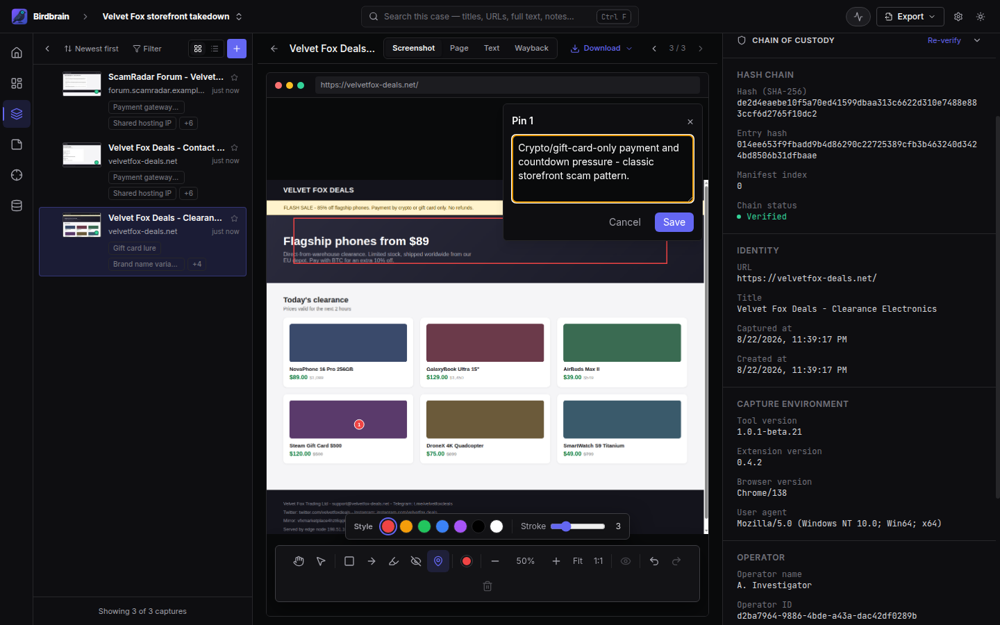
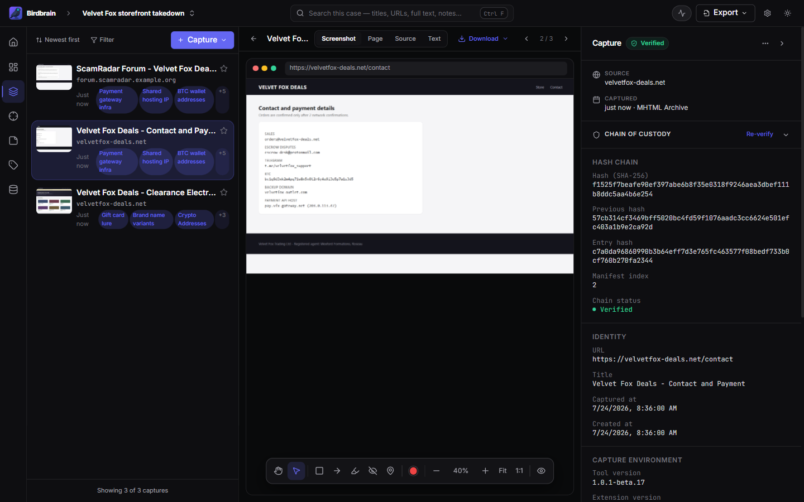

<p align="center">
  
</p>

<h1 align="center">Birdbrain</h1>

<p align="center">
  Local-first web evidence capture for OSINT investigations.<br />
  Every capture is hashed, signed, timestamped, and chained into a verifiable audit manifest.
</p>

<p align="center">
  <a href="https://github.com/thebristolsound/birdbrain-releases/releases"></a>
  <a href="https://github.com/thebristolsound/birdbrain/actions/workflows/ci.yml"></a>
  
  <a href="LICENSE"></a>
  
</p>

---

Birdbrain is an open source desktop app with a companion Chromium extension for capturing,
organizing, and verifying web evidence. Each capture holds MHTML, a full-page screenshot, and
extracted page text. The extension sends it to the desktop app over `127.0.0.1`, and the app
stores it in a per-case archive on disk. There is no cloud account and no telemetry. Captures stay
on your machine unless you export them.

<p align="center">
  
</p>

## Why Birdbrain exists

Capture tools that independent investigators depend on keep moving into enterprise platforms,
adding license-server checks, or shutting down. Researchers, journalists, activists, and small
teams are left with fewer affordable ways to preserve web evidence on hardware they control.
Birdbrain keeps that workflow in an MIT-licensed desktop app that runs locally, checks no license,
and writes evidence in formats you can inspect, export, and keep using if the project is forked.

## What it does

**Capture.** Save a page as MHTML with a full-page screenshot and extracted text, from the
extension popup or the right-click menu in Chrome, Edge, or Brave. The desktop app can also
capture a pasted list of URLs, or recapture a page later, by rendering it in a hidden window.

**Prove.** Birdbrain hashes every capture with `SHA-256` and appends it to a per-case,
hash-chained `manifest.jsonl`. Each entry carries an RSA signature from a per-install key and a
timestamp token from an RFC 3161 authority, DigiCert by default.

**Verify.** Check a capture inside the app, or export an evidence package. The zip holds
`manifest.jsonl`, `report.html`, `certification.html`, the public key, the timestamp authority
certificates, and `VERIFY.md`, a runbook that reproduces the whole check with `sha256sum`,
`openssl`, and `jq` alone. `verify.sh` ships beside it and runs those same six steps in one
command, exiting non-zero and naming the step when one fails.

**Organize.** Group captures into cases and tag them. Write rich-text notes that link to a capture
or another note with `@`, or to a selector or tag with `#`, and Birdbrain derives a backlink index
from those links. Draw shapes and numbered pins on screenshots. Birdbrain burns the annotations
into the exported report and leaves the stored original untouched.

**Find.** Search a case's captures, notes, and extracted indicators with SQLite FTS5. Define text
or regular-expression **Selectors** and Birdbrain runs them against existing and future captures,
caching the matches for case-wide counts.

**Pivot.** Birdbrain extracts indicators from every capture: IP addresses, domains, email
addresses, file hashes, CVE identifiers, MAC addresses, autonomous system numbers, cryptocurrency
addresses, tracking codes, social handles, and `.onion` and I2P hosts. Open the captures where
each one appeared.

## Screenshots

<p align="center">
  
  <em>Annotation editor. Shapes and pinned comments, burned into exports</em>
</p>
<p align="center">
  
  <em>Recon. Pivot from an indicator category to the pages it appeared on</em>
</p>
<p align="center">
  
  <em>Verify. The per-case hash chain checked in the app</em>
</p>
<p align="center">
  
  <em>Export. A self-contained report that any browser reads and anyone can verify without Birdbrain</em>
</p>

The [screenshot tour](https://thebristolsound.github.io/birdbrain/docs/screenshots/) has the rest:
onboarding, dashboard, signals, notes, command palette, and settings.

## Install

1. Download Birdbrain for your platform from the
   [releases page](https://github.com/thebristolsound/birdbrain-releases/releases) and install it.
2. Open Birdbrain. On the dashboard, click **Install Extension**. Birdbrain opens the extension
   folder for you.
3. Load the extension in Chrome. Open `chrome://extensions`, turn on **Developer mode**, click
   **Load unpacked**, and select the folder Birdbrain opened.
4. Pin the Birdbrain extension to your toolbar.
5. Return to Birdbrain. The dashboard walks you through creating your first case and capturing
   your first page.

Windows and Linux builds ship with every release. macOS builds are produced on request. The
extension is not on the Chrome Web Store, so it installs unpacked.

For platform-specific detail, including the `libfuse2` dependency on Ubuntu, clearing the macOS
quarantine attribute, and how updates install, read the
[tester guide](https://thebristolsound.github.io/birdbrain/docs/tester-guide/).

## Documentation

The [documentation site](https://thebristolsound.github.io/birdbrain/) carries the full reference,
including the capture pipeline, the standards register, and adoption guides. Two pages matter most
if you are weighing the evidence claims:

- The [threat model](https://thebristolsound.github.io/birdbrain/docs/threat-model/) states what
  the chain-of-custody controls defend against and what they deliberately do not.
- The
  [architecture whitepaper](https://thebristolsound.github.io/birdbrain/docs/birdbrain-architecture-whitepaper/)
  covers trust boundaries and the limits of the evidence claims. Start there for a security review.

Birdbrain can also run a per-capture AI analysis through OpenRouter. It needs an API key you
supply, it stays off until you configure it in Settings, and it is the only feature that sends
capture content off your machine.

## Current limitations

Birdbrain is beta software. What it cannot do yet:

- **Search is per-case.** There is no cross-case search.
- **Capture is page-level and manual.** No element selection, no region screenshots, and no video.
  The extension does not save pages automatically as you browse. That path exists in the code but
  is turned off in the shipped build.
- **One user, one machine.** No shared cases and no team sync. A case moves between machines only
  as a `.birdbrain` archive you carry yourself.
- **Timestamping is asynchronous and always on.** A capture stays `pending` until the timestamp
  authority answers, and stays `pending` while you are offline. You can change which authority
  Birdbrain asks. You cannot turn it off.
- **The evidence claims have limits.** The signing key is local to your install rather than an
  independent trust anchor, the standalone verifier binary is not published yet, and the
  certification document still carries placeholder legal wording. Read the
  [threat model](https://thebristolsound.github.io/birdbrain/docs/threat-model/) before you rely
  on any of it.

## Build from source

```bash
git clone https://github.com/thebristolsound/birdbrain.git
cd birdbrain
pnpm install
pnpm dev
```

`pnpm build:extension` writes the unpacked extension to `extension/dist`.

Use Node 20. `engines.node` is only a floor, so Node 24 satisfies it and then breaks Electron's
`postinstall` step without failing the install. Both `.nvmrc` and `.mise.toml` pin the right version.
[CONTRIBUTING.md](CONTRIBUTING.md) covers the rest of the setup and the checks to run before a
pull request.

## Contributing

Open an [issue](https://github.com/thebristolsound/birdbrain/issues) for bug reports and feature
requests. For anything non-trivial, open an issue before the pull request so the approach can be
agreed first. [CONTRIBUTING.md](CONTRIBUTING.md) covers maintainer capacity, supported scope, and
inbound licensing. [CODE_OF_CONDUCT.md](CODE_OF_CONDUCT.md) sets the ground rules, including the
rule against putting live investigation subjects in a bug report. To report a security issue, read
[SECURITY.md](SECURITY.md).

## Acknowledgements

Birdbrain uses these open source projects:

- [ioc-extractor](https://github.com/ninoseki/ioc-extractor) for indicator extraction
- [Konva](https://konvajs.org/) for the screenshot annotation canvas
- [Hono](https://hono.dev/) for the local capture server
- [shadcn/ui](https://ui.shadcn.com/) and [Radix](https://www.radix-ui.com/) for UI primitives
- [better-sqlite3](https://github.com/WiseLibs/better-sqlite3) for the database under every case

## Disclaimer

Birdbrain is beta software, provided as-is and without warranty of any kind. Data formats may
change between releases, and no court has tested the evidence workflow. Do not rely on Birdbrain
as your only copy of evidence that matters. Verify your exports and keep backups.

Birdbrain is built for lawful investigation and research. You are solely responsible for how you
use it, including compliance with applicable law and the terms of service of any site you capture.
The authors and contributors accept no liability for misuse.

## License

MIT. See [LICENSE](LICENSE).
