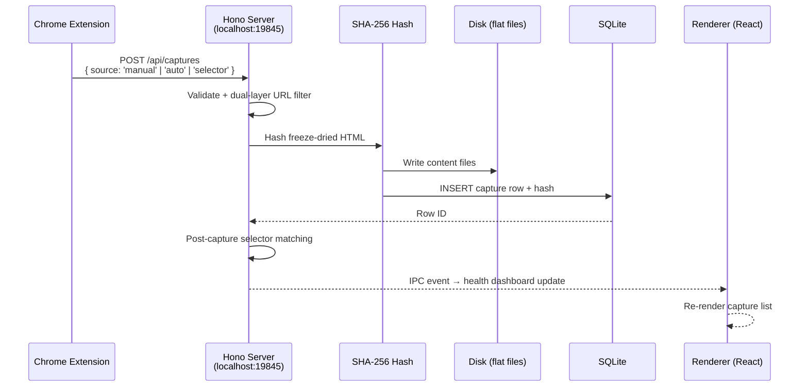

<!-- Improved compatibility of back to top link: See: https://github.com/othneildrew/Best-README-Template/pull/73 -->
<a id="readme-top"></a>

[![Contributors][contributors-shield]][contributors-url]
[![Forks][forks-shield]][forks-url]
[![Stargazers][stars-shield]][stars-url]
[![Issues][issues-shield]][issues-url]
[![License: MIT][license-shield]][license-url]
[![Status: Alpha][status-shield]]()
[![Platform][platform-shield]]()

<!-- PROJECT LOGO -->
<br />
<div align="center">
  <a href="https://github.com/thebristolsound/birdbrain">
    
  </a>

  <h3 align="center">Birdbrain</h3>

  <p align="center">
    Capture the web as evidence. Local-first, cryptographically verifiable, zero cloud.
    <br />
    <a href="https://github.com/thebristolsound/birdbrain/tree/master/docs"><strong>Explore the docs »</strong></a>
    <br />
    <br />
    <a href="https://github.com/thebristolsound/birdbrain/issues/new?labels=bug&template=bug-report---.md">Report Bug</a>
    &middot;
    <a href="https://github.com/thebristolsound/birdbrain/issues/new?labels=enhancement&template=feature-request---.md">Request Feature</a>
  </p>
</div>

<!-- TABLE OF CONTENTS -->
<details>
  <summary>Table of Contents</summary>
  <ol>
    <li><a href="#about-the-project">About The Project</a></li>
    <li><a href="#built-with">Built With</a></li>
    <li>
      <a href="#getting-started">Getting Started</a>
      <ul>
        <li><a href="#prerequisites">Prerequisites</a></li>
        <li><a href="#installation">Installation</a></li>
        <li><a href="#loading-the-chrome-extension">Loading the Chrome Extension</a></li>
      </ul>
    </li>
    <li><a href="#usage">Usage</a></li>
    <li><a href="#roadmap">Roadmap</a></li>
    <li><a href="#contributing">Contributing</a></li>
    <li><a href="#license">License</a></li>
    <li><a href="#contact">Contact</a></li>
    <li><a href="#acknowledgments">Acknowledgments</a></li>
  </ol>
</details>

---

## About The Project

You're doing web research that matters — documenting extremist content, tracking fraud networks, investigating a story. You need to prove, later, that a page said what it said when you found it. Screenshots lie. PDFs strip context. Browser history evaporates.

**Birdbrain** is a local-first desktop app for investigators who need cryptographically verifiable web captures. Not screenshots, not PDFs — the actual live DOM frozen to a self-contained file, SHA-256 hashed the moment it hits disk. Built for OSINT researchers, journalists, and fraud investigators who can't afford to lose chain of custody.

Everything lives on your machine. No cloud, no accounts, no one else's retention policy. Think of it as a local-first, open source alternative to commercial tools like Hunchly.

**Key features:**

- **SHA-256 integrity** — every capture is hashed at ingestion; re-verify at any time to prove nothing changed
- **Freeze-dry serialization** — pages become self-contained HTML with CSS, fonts, and images inlined as data URIs; they open offline, forever
- **Cases** — organize captures into investigations with metadata, selectors, and notes
- **Selectors** — define regex, glob, or literal string patterns; the extension highlights matches on live pages and can auto-capture when a match is found
- **Tags & bulk operations** — keyboard-driven tagging across captures
- **Full-text search** — SQLite FTS5 across all captured content
- **HTML/PDF export** — generate audit-trail reports with investigator name, timestamps, and per-capture hash verification
- **Health dashboard** — live ring-buffered capture feed with timings and error categorization

> **Early alpha — v0.1.0.** Core pipeline, cases, tags, selectors, notes, search, and export are all working. See the [Roadmap](#roadmap) for what's next.

<p align="right">(<a href="#readme-top">back to top</a>)</p>

---

## Built With

| Layer | Technology |
|---|---|
| Desktop shell | [Electron 35](https://www.electronjs.org/) + [electron-vite](https://electron-vite.org/) + [electron-builder](https://www.electron.build/) |
| UI | [React 19](https://react.dev/), [Tailwind CSS v4](https://tailwindcss.com/), [Zustand](https://zustand-demo.pmnd.rs/), [TanStack Router](https://tanstack.com/router), [TanStack Query](https://tanstack.com/query) |
| Capture server | [Hono 4](https://hono.dev/) (HTTP, runs in Electron main process) |
| Database | [better-sqlite3](https://github.com/WiseLibs/better-sqlite3) — synchronous, WAL mode, FTS5 |
| Page serialization | [freeze-dry](https://github.com/WebMemex/freeze-dry) |
| Language | [TypeScript](https://www.typescriptlang.org/) (strict) |
| Testing | [Vitest](https://vitest.dev/) (unit), [Playwright](https://playwright.dev/) (E2E against real Electron) |
| Package manager | [pnpm](https://pnpm.io/) |

<p align="right">(<a href="#readme-top">back to top</a>)</p>

---

## Getting Started

### Prerequisites

- **Node.js** 20 or later
- **pnpm** 9 or later (`npm install -g pnpm`)
- **Google Chrome** (for the extension)

### Installation

```bash
# Clone the repo
git clone https://github.com/thebristolsound/birdbrain.git
cd birdbrain

# Install dependencies (also rebuilds native modules for your Electron version)
pnpm install

# Start the desktop app in dev mode with hot reload
pnpm dev
```

**Other useful commands:**

```bash
pnpm build               # Production build
pnpm package             # Package platform installers (NSIS / DMG / AppImage)
pnpm test                # Vitest unit tests
pnpm test:e2e            # Playwright E2E against a built app
pnpm test:e2e:debug      # Playwright with inspector
pnpm lint                # ESLint
pnpm format              # Prettier
pnpm rebuild:electron    # Rebuild native deps after a Node version upgrade
```

### Loading the Chrome Extension

```bash
# Build the extension once
pnpm build:extension

# Or keep it rebuilding automatically during development
pnpm dev:extension
```

Then load it into Chrome:

1. Open `chrome://extensions`
2. Enable **Developer mode** (toggle in the top-right corner)
3. Click **Load unpacked**
4. Select the `extension/dist` directory inside the cloned repo
5. The Birdbrain icon will appear in your toolbar

The extension talks to the desktop app at `http://localhost:19845`. Start the desktop app first — the extension popup shows connection status so you can confirm the link is live.

> **Note:** Rebuild the extension (`pnpm build:extension`) after any changes to `extension/src/`. The `pnpm dev:extension` watch mode handles this automatically.

<p align="right">(<a href="#readme-top">back to top</a>)</p>

---

## Usage

### How the pipeline works



Click the extension icon to manually capture the current page, or set up **Selectors** in a case to auto-capture any page whose URL or content matches your patterns. Every capture lands in the desktop app, hashed and stored, ready to add to a case, tag, and annotate.

For a technical deep-dive into the capture pipeline, error handling, selector matching, and hash verification, see [docs/reference/capture-pipeline.md](docs/reference/capture-pipeline.md).

### Project structure

<details>
<summary>Expand directory tree</summary>

```
birdbrain/
├── src/
│   ├── main/                  # Electron main process
│   │   ├── services/
│   │   │   ├── captureServer.ts   # Hono HTTP server (port 19845)
│   │   │   ├── database.ts        # SQLite + schema migrations
│   │   │   ├── storage.ts         # File I/O for capture content
│   │   │   ├── export.ts          # HTML/PDF report generation
│   │   │   ├── hash.ts            # SHA-256 integrity
│   │   │   └── settings.ts        # Persistent user settings
│   │   └── ipcHandlers.ts     # All IPC handler registrations
│   ├── preload/               # contextBridge IPC bridge
│   ├── renderer/              # React UI
│   │   ├── stores/            # Zustand app store
│   │   ├── hooks/             # useCases, useCaptures, useTags, useSearch, …
│   │   └── components/        # Feature-organized UI components
│   └── shared/
│       ├── types.ts           # Case, Capture, Tag, Selector, …
│       └── ipc.ts             # Typed IPC channel definitions
├── extension/
│   └── src/
│       ├── background.ts      # Service worker
│       ├── content.ts         # freeze-dry, selector matching, Shadow-DOM toasts
│       └── popup/             # Extension popup UI
├── e2e/                       # Playwright E2E tests
├── tests/                     # Vitest unit tests
└── docs/                      # Technical documentation
```

</details>

<p align="right">(<a href="#readme-top">back to top</a>)</p>

---

## Roadmap

**v0.1.0 — working now:**

- [x] Full capture pipeline (manual, auto, selector-triggered)
- [x] Cases, tags, notes, bulk operations
- [x] Selectors (regex, glob, literal) with live page highlighting
- [x] SHA-256 integrity and re-verification
- [x] Full-text search (SQLite FTS5)
- [x] HTML and PDF export with audit trail
- [x] Health dashboard with real-time capture feed

**Coming next:**

- [ ] UI design refresh
- [ ] AI features — entity extraction, relationship mapping, pattern detection via OpenRouter BYOK (removed in a recent refactor; being redesigned for the next iteration)
- [ ] Hunchly import
- [ ] Additional export formats

The project is actively developed. Expect breaking changes before 1.0.

See [open issues](https://github.com/thebristolsound/birdbrain/issues) for the full list of proposed features and known bugs.

<p align="right">(<a href="#readme-top">back to top</a>)</p>

---

## Contributing

Standard GitHub flow: fork the repo, create a branch, open a PR against `master`.

1. Fork the project
2. Create your feature branch (`git checkout -b feature/my-feature`)
3. Commit your changes (`git commit -m 'Add my feature'`)
4. Push to the branch (`git push origin feature/my-feature`)
5. Open a Pull Request

**Code style** is enforced via ESLint + Prettier:

| Rule | Value |
|---|---|
| Semicolons | None |
| Quotes | Single |
| Trailing commas | None |
| Print width | 100 characters |
| Indent | 2 spaces |
| TypeScript | Strict mode |

Tests are required for non-trivial changes. Run `pnpm test` for unit tests and `pnpm test:e2e` for end-to-end. Both must pass before a PR will be reviewed.

<p align="right">(<a href="#readme-top">back to top</a>)</p>

---

## License

Distributed under the MIT License. See [LICENSE](LICENSE) for more information.

<p align="right">(<a href="#readme-top">back to top</a>)</p>

---

## Contact

Matt Donovan — [@thebristolsound](https://github.com/thebristolsound)

Project link: [https://github.com/thebristolsound/birdbrain](https://github.com/thebristolsound/birdbrain)

<p align="right">(<a href="#readme-top">back to top</a>)</p>

---

## Acknowledgments

- [freeze-dry](https://github.com/WebMemex/freeze-dry) — the page serialization library that makes offline-complete captures possible
- [better-sqlite3](https://github.com/WiseLibs/better-sqlite3) — synchronous SQLite bindings that keep the main process simple
- [Hono](https://hono.dev/) — the lightweight server that receives captures from the extension
- [electron-vite](https://electron-vite.org/) — fast Vite-based build tooling for Electron
- [Best-README-Template](https://github.com/othneildrew/Best-README-Template) — README structure

<p align="right">(<a href="#readme-top">back to top</a>)</p>

---

<!-- MARKDOWN LINKS & IMAGES -->
[contributors-shield]: https://img.shields.io/github/contributors/thebristolsound/birdbrain.svg?style=for-the-badge
[contributors-url]: https://github.com/thebristolsound/birdbrain/graphs/contributors
[forks-shield]: https://img.shields.io/github/forks/thebristolsound/birdbrain.svg?style=for-the-badge
[forks-url]: https://github.com/thebristolsound/birdbrain/network/members
[stars-shield]: https://img.shields.io/github/stars/thebristolsound/birdbrain.svg?style=for-the-badge
[stars-url]: https://github.com/thebristolsound/birdbrain/stargazers
[issues-shield]: https://img.shields.io/github/issues/thebristolsound/birdbrain.svg?style=for-the-badge
[issues-url]: https://github.com/thebristolsound/birdbrain/issues
[license-shield]: https://img.shields.io/github/license/thebristolsound/birdbrain.svg?style=for-the-badge
[license-url]: https://github.com/thebristolsound/birdbrain/blob/master/LICENSE
[status-shield]: https://img.shields.io/badge/status-alpha-orange.svg?style=for-the-badge
[platform-shield]: https://img.shields.io/badge/platform-Windows%20%7C%20macOS%20%7C%20Linux-lightgrey.svg?style=for-the-badge
