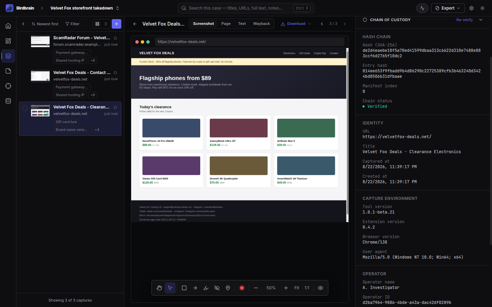
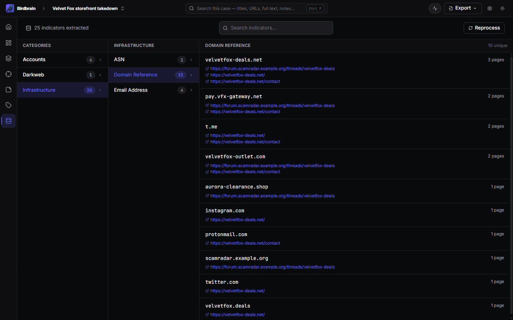

  

<h1 align="center">Birdbrain</h1>

  <strong>Save web pages as evidence you can prove.</strong> 
  Free, open source OSINT capture for investigators. Runs on your machine, not in someone's cloud.

  
  
  
  
  

  <a href="https://github.com/thebristolsound/birdbrain-releases/releases"><strong>Download</strong></a> ·
  <a href="https://thebristolsound.github.io/birdbrain/">Documentation</a> ·
  <a href="https://thebristolsound.github.io/birdbrain/docs/screenshots/">Screenshot tour</a>

---

The post you found last week is gone. Your screenshot shows what it said, but not when you saw
it, and nothing stops someone from claiming you edited it.

Birdbrain is a desktop app and Chrome extension for OSINT investigators, journalists and
researchers who need web evidence that holds up. Save a page in one click and Birdbrain keeps the
whole page, a full-page screenshot and its text, then seals the capture with a fingerprint, a
signature and an independent timestamp. When you hand your work over, anyone can check that
nothing changed since you captured it, without installing Birdbrain.

  

## How it works

1. **Capture.** Click the extension, or right-click any page in Chrome. Birdbrain saves the page
   into the case you are working on. You can also paste a list of URLs and let the desktop app
   capture them in the background.
2. **Build the case.** Tag captures, write notes that link to them, and mark up screenshots with
   shapes and numbered pins. Birdbrain pulls out indicators like domains, emails, IP addresses,
   crypto wallets and social handles, and shows every page each one appeared on.
3. **Hand it over.** Export an evidence package: the pages, a readable report, and a step-by-step
   guide that lets anyone check every file with standard tools. A one-command script runs the
   same checks.

## Why investigators use it

- **Proof is built in, not bolted on.** Every capture gets a SHA-256 fingerprint, a signature and
  an RFC 3161 timestamp from an independent authority, and joins a tamper-evident chain of
  custody for the case. You don't have to remember to do anything.
- **Your case stays on your machine.** No account, no cloud, no telemetry, no license server.
  Captures leave your computer only when you export them.
- **Pivot from what you found.** Birdbrain extracts indicators from every page: IP addresses,
  domains, emails, file hashes, CVE identifiers, crypto addresses, tracking codes, social handles, and
  `.onion` and I2P hosts. Click one to see every capture it appears in.
- **Watch for what matters.** Save a word, name or pattern as a selector and Birdbrain flags it
  in every capture you have made and every one you make next.
- **Nothing is locked in.** Evidence is plain files in open formats, and the app is MIT licensed.
  If the project stopped tomorrow, your exported evidence would still verify.

  
  

<em>Pivot on indicators across a case, and export a report anyone can verify.</em>

## Get started

1. Download Birdbrain for Windows or Linux from the
   [releases page](https://github.com/thebristolsound/birdbrain-releases/releases) and install it.
2. Open Birdbrain and click **Open extension folder** on the dashboard.
3. In Chrome, open `chrome://extensions`, turn on **Developer mode**, click **Load unpacked**, and
   select that folder. Pin the extension to your toolbar.
4. Back in Birdbrain, a short guided tour walks you through your first case and your first capture.

The extension isn't on the Chrome Web Store yet, which is why it loads unpacked. macOS builds are
available on request. The [tester guide](https://thebristolsound.github.io/birdbrain/docs/tester-guide/)
covers platform details and updates.

## Know the limits

Birdbrain is beta software. Before you rely on it:

- **You capture each page yourself.** It doesn't record automatically as you browse, and it
  doesn't save video.
- **One investigator, one machine.** There are no shared cases yet. You can move a case to another
  machine as an archive file.
- **Search works within a case**, not across cases.
- **The proof has limits.** A verified chain shows nobody edited the record without your install's
  signing key. It does not show that the page itself was genuine, and no court has tested the workflow yet. The
  [threat model](https://thebristolsound.github.io/birdbrain/docs/threat-model/) says exactly what
  the chain of custody does and does not prove.

## Privacy and network use

Captured content never leaves your machine unless you export it. Birdbrain does make a few
outbound connections: it sends each capture's fingerprint (never its content) to the timestamp
authority, contacts the captured site once more to record its security certificate, looks up the
Internet Archive when you ask, downloads cookie-banner filter lists, and checks GitHub for updates.
If you work through a VPN or Tor, route the whole machine. [SECURITY.md](SECURITY.md) lists every
host.

## For reviewers and contributors

- **Evaluating the evidence claims?** Start with the
  [threat model](https://thebristolsound.github.io/birdbrain/docs/threat-model/) and the
  [architecture whitepaper](https://thebristolsound.github.io/birdbrain/docs/birdbrain-architecture-whitepaper/).
- **Building from source?** Clone the repo, then run `pnpm install` and `pnpm dev` on Node 20.
  [CONTRIBUTING.md](CONTRIBUTING.md) has the full setup and the checks to run before a pull
  request.
- **Found a bug or want a feature?** Open an [issue](https://github.com/thebristolsound/birdbrain/issues),
  and open one before any non-trivial pull request. Please never put a live investigation subject
  in a bug report ([CODE_OF_CONDUCT.md](CODE_OF_CONDUCT.md)). Report security issues through
  [SECURITY.md](SECURITY.md).

Birdbrain is built on [ioc-extractor](https://github.com/ninoseki/ioc-extractor),
[Konva](https://konvajs.org/), [Hono](https://hono.dev/), [shadcn/ui](https://ui.shadcn.com/),
[Radix](https://www.radix-ui.com/) and [better-sqlite3](https://github.com/WiseLibs/better-sqlite3).

## Disclaimer

Birdbrain is provided as-is, without warranty of any kind. Data formats may change between beta
releases. Don't rely on Birdbrain as your only copy of evidence that matters: verify your exports
and keep backups.

Birdbrain is built for lawful investigation and research. You are responsible for how you use it,
including compliance with applicable law and the terms of service of any site you capture. The
authors and contributors accept no liability for misuse.

## License

MIT. See [LICENSE](LICENSE).
