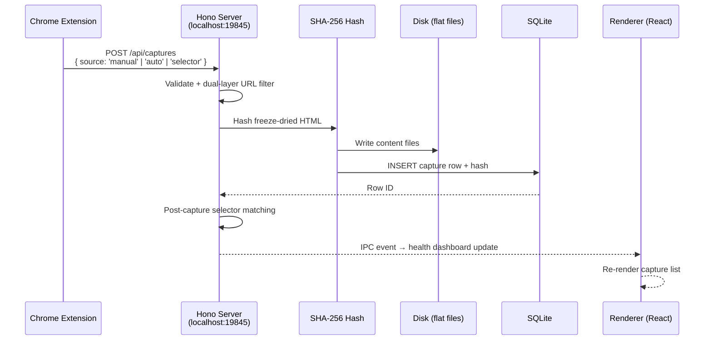

# Birdbrain

**Capture the web as evidence.**

Birdbrain is a local-first desktop app for investigators who need cryptographically verifiable web captures — not screenshots, not PDFs, but the actual live DOM frozen to a self-contained file, SHA-256 hashed the moment it hits disk. Built for OSINT researchers, journalists, and fraud investigators who can't afford to lose chain of custody.

[](LICENSE)
[]()
[]()
[](https://www.electronjs.org/)
[](https://www.typescriptlang.org/)

> **Early alpha — v0.1.0.** Core capture pipeline, cases, tags, selectors, notes, search, and HTML/PDF export are working. The UI is getting a design refresh. See [Status & Roadmap](#status--roadmap) for what's next.

---

## Who is this for?

You're doing web research that matters — documenting extremist content, tracking fraud networks, investigating a story. You need to prove, later, that a page said what it said when you found it. Screenshots lie. PDFs strip context. Browser history evaporates.

Birdbrain captures the full DOM at investigation time, hashes it immediately, and keeps everything on your machine. No cloud. No accounts. No one else's retention policy.

Think of it as a local-first, open source alternative to commercial tools like Hunchly.

---

## ✨ Features

### Evidence integrity
- **SHA-256 hashing** — every capture is hashed at the moment of ingestion, stored in SQLite, and can be re-verified at any time to prove nothing was tampered with
- **Freeze-dry serialization** — pages are rendered to self-contained HTML with CSS, fonts, and images inlined as data URIs; captures open offline, forever, with no external dependencies
- **Graceful fallback** — if freeze-dry fails, Birdbrain falls back to raw HTML rather than silently dropping the capture

### Investigation workflow
- **Cases** — organize captures into investigations; selectors and metadata travel with the case
- **Tags** — apply tags across captures with bulk operations and keyboard-driven workflows
- **Notes** — attach freeform notes to any capture
- **Full-text search** — SQLite FTS5 across all captured content

### 🔍 Selectors
Define regex, glob, or literal string patterns per case. The Chrome extension highlights matches on live pages as you browse and can auto-capture any page that matches — so you don't miss evidence because you weren't watching.

### Observable pipeline
A live health dashboard shows capture activity in a ring-buffered 50-event feed: received, stored, failed, skipped — with timings and error categorization. Test buttons let you verify the end-to-end pipeline without the extension.

### Export & reporting
Generate HTML or PDF reports with a full audit trail: investigator name, capture timestamps, and per-capture hash verification status.

### Local-first, zero telemetry
All captures, metadata, and indexes live in SQLite and flat files on your machine. Nothing leaves unless you export it.

---

## 🏗 How it works



The extension sends a single POST regardless of capture mode (manual click, auto, or selector match). One endpoint, one pipeline — no drift between modes.

**Dual-layer URL filtering** — the extension filters client-side before sending; the server re-validates on receipt. Defense in depth, supporting regex, glob, and literal substring patterns.

For a full technical deep-dive, see [docs/capture-pipeline.md](docs/capture-pipeline.md).

---

## Tech stack

| Layer | Technology |
|---|---|
| Desktop shell | Electron 35 + electron-vite + electron-builder |
| UI | React 19, Tailwind CSS v4, Zustand, TanStack Router, TanStack Query |
| Capture server | Hono 4 (HTTP, runs in main process) |
| Database | better-sqlite3 — synchronous, WAL mode, FTS5 |
| Page serialization | freeze-dry |
| Language | TypeScript (strict) |
| Testing | Vitest (unit), Playwright (E2E against real Electron) |
| Package manager | pnpm |

---

## 🚀 Getting started

### Prerequisites

- Node.js 20+
- pnpm 9+
- Google Chrome (for the extension)

### Desktop app

```bash
# Clone and install
git clone https://github.com/thebristolsound/birdbrain.git
cd birdbrain
pnpm install

# Start in dev mode (Electron + hot reload)
pnpm dev
```

```bash
# Other useful commands
pnpm build               # Production build
pnpm package             # Package platform installers via electron-builder
pnpm test                # Vitest unit tests
pnpm test:e2e            # Playwright E2E against a built app
pnpm test:e2e:debug      # Playwright with inspector
pnpm lint                # ESLint
pnpm format              # Prettier
pnpm rebuild:electron    # Rebuild native deps (better-sqlite3) after Node upgrade
```

### Chrome extension

```bash
# Build the extension
pnpm build:extension

# Or watch-mode during development
pnpm dev:extension
```

---

## Loading the Chrome extension

1. Open Chrome and navigate to `chrome://extensions`
2. Enable **Developer mode** (toggle in the top-right corner)
3. Click **Load unpacked**
4. Select the `extension/dist` directory inside the cloned repo
5. The Birdbrain icon will appear in your toolbar

The extension connects to the desktop app at `http://localhost:19845`. Start the desktop app first, then browse — the extension's popup shows connection status.

> **Note:** The extension must be rebuilt (`pnpm build:extension`) whenever you make changes to `extension/src/`. The `pnpm dev:extension` watch mode handles this automatically during development.

---

## Project structure

```
birdbrain/
├── src/
│   ├── main/                  # Electron main process
│   │   ├── services/          # Core services
│   │   │   ├── captureServer.ts   # Hono HTTP server (port 19845)
│   │   │   ├── database.ts        # SQLite + schema migrations
│   │   │   ├── storage.ts         # File I/O for capture content
│   │   │   ├── export.ts          # HTML/PDF report generation
│   │   │   ├── hash.ts            # SHA-256 integrity
│   │   │   └── settings.ts        # Persistent user settings
│   │   └── ipcHandlers.ts     # All IPC handler registrations
│   ├── preload/               # contextBridge IPC bridge
│   ├── renderer/              # React UI
│   │   ├── stores/            # Zustand app store
│   │   ├── hooks/             # useCases, useCaptures, useTags, useSearch, …
│   │   └── components/        # Feature-organized UI components
│   └── shared/
│       ├── types.ts           # Case, Capture, Tag, Selector, …
│       └── ipc.ts             # Typed IPC channel definitions
├── extension/
│   └── src/
│       ├── background.ts      # Service worker
│       ├── content.ts         # freeze-dry, selector matching, Shadow-DOM toasts
│       └── popup/             # Extension popup UI
├── e2e/                       # Playwright E2E tests
├── tests/                     # Vitest unit tests
├── docs/                      # Technical documentation
└── electron.vite.config.ts
```

---

## 📖 Deep dive

The capture pipeline is documented in detail — architecture decisions, error handling, the selector matching flow, hash verification, and the health dashboard design:

**[docs/capture-pipeline.md](docs/capture-pipeline.md)**

---

## Status & roadmap

**v0.1.0 — early alpha.** The following are working:

- Full capture pipeline (manual, auto, selector-triggered)
- Cases, tags, notes, bulk operations
- Selectors (regex, glob, literal) with live page highlighting
- SHA-256 integrity and re-verification
- Full-text search (SQLite FTS5)
- HTML and PDF export with audit trail
- Health dashboard with real-time capture feed

**In progress / coming next:**

- UI design refresh
- AI features (entity extraction, relationship mapping, pattern detection via OpenRouter BYOK) — removed in a recent refactor and being redesigned for the next iteration
- Hunchly import
- More export formats

The project is actively developed. Expect breaking changes before 1.0.

---

## Contributing

Standard GitHub flow: fork the repo, create a branch, open a PR against `master`.

**Code style** — enforced via ESLint + Prettier:
- No semicolons
- Single quotes
- No trailing commas
- 100-character print width
- 2-space indent
- TypeScript strict mode throughout

Tests are required for non-trivial changes. Run `pnpm test` for unit tests and `pnpm test:e2e` for end-to-end. Both must pass before a PR will be reviewed.

---

## License

MIT — see [LICENSE](LICENSE).

---

*Built by [Matt Donovan](https://github.com/thebristolsound) and contributors.*
