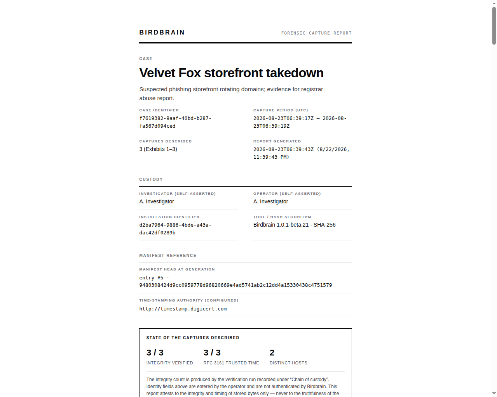

# Birdbrain

Birdbrain is a local-first, open source desktop app, with a companion Chromium extension, for
OSINT investigators and journalists who need to capture web pages as evidence, organize them
into cases, and show later that the record has not changed. It runs on Windows and Ubuntu, has
an experimental macOS build, and is in public beta.

Birdbrain covers much of the same ground as Hunchly, case-based web capture for
investigations, and it is open source. Unlike Hunchly, this beta does not capture pages
automatically as you browse. Archiving tools such as ArchiveBox and Webrecorder focus on
preserving and replaying pages. Birdbrain is built around the investigation: cases, selectors,
extracted indicators, notes, and exports.

[](https://github.com/thebristolsound/birdbrain-releases/releases)
[](https://github.com/thebristolsound/birdbrain/actions/workflows/ci.yml)
[](https://github.com/thebristolsound/birdbrain/actions/workflows/security.yml)
[](https://github.com/thebristolsound/birdbrain/actions/workflows/package-smoke.yml)
[](https://github.com/thebristolsound/birdbrain/actions/workflows/ci.yml?query=branch%3Amain+event%3Apush)
[](https://github.com/thebristolsound/birdbrain-releases/releases)

[](LICENSE)


[](https://github.com/thebristolsound/birdbrain/graphs/contributors)
[](https://github.com/thebristolsound/birdbrain/forks)
[](https://github.com/thebristolsound/birdbrain)
[](https://github.com/thebristolsound/birdbrain/issues)

[Download](https://docs.birdbrain.cc/docs/download) ·
[Install and first capture](https://docs.birdbrain.cc/docs/tester-guide) ·
[Screenshot tour](https://docs.birdbrain.cc/docs/screenshots) ·
[Threat model](https://docs.birdbrain.cc/docs/threat-model) ·
[Architecture whitepaper](https://docs.birdbrain.cc/docs/birdbrain-architecture-whitepaper)


## How it works

1. **Capture.** Click the extension on a page. Birdbrain saves the page as MHTML, a full-page
   screenshot, and the extracted page text. The extension sends the capture to the desktop app
   over `127.0.0.1`, and the app stores it in a per-case folder on your machine.
2. **Record.** Birdbrain hashes the stored bytes with SHA-256 and appends a signed entry to the
   case's hash-chained manifest. It also requests an RFC 3161 timestamp token for the content
   hash. The capture's trusted time stays `pending` until the timestamp authority answers, for
   example while you are offline.
3. **Verify.** You can check the manifest chain in the app. An exported evidence package
   includes a `VERIFY.md` runbook that repeats the check with `sha256sum`, `openssl`, and `jq`,
   so the recipient does not need Birdbrain installed.

Birdbrain has no account and no telemetry. Captures leave the machine only when you export
them.



### What verification shows

A verified chain shows that nobody changed the record without the install's signing key. It
does not show that the page itself was genuine, and no court has tested the workflow. The
[threat model](https://docs.birdbrain.cc/docs/threat-model) lists what the controls defend
against and what they do not.

## Install

[](https://github.com/thebristolsound/birdbrain-releases/releases)
[](https://github.com/thebristolsound/birdbrain-releases/releases)

Builds are on the
[releases page](https://github.com/thebristolsound/birdbrain-releases/releases), in a separate
public repository that holds releases only. You need no GitHub account to download one.

| Platform | Format | Status |
| - | - | - |
| Windows 10 / 11 | `.exe` installer | Supported. Not code-signed, so SmartScreen warns the first time you run it. |
| Ubuntu | AppImage | Supported, and the primary Linux build. Needs FUSE 2 (`libfuse2t64`, or `libfuse2` on 22.04 and earlier). |
| Ubuntu | `.deb` | Best-effort. |
| macOS | `.dmg` | Experimental. Unsigned, not notarized, and not launch-tested before publishing. Apple Silicon and Intel builds. The app reports updates but does not install them. |

Releases from 1.0.1-beta.22 on include `SHA256SUMS.txt` and an SPDX software bill of materials.
Check the download against the published hashes before you run it:

```bash
# Ubuntu
sha256sum --check --ignore-missing SHA256SUMS.txt
```

```powershell
# Windows: compare the output with the matching line in SHA256SUMS.txt.
# PowerShell prints the hash in capitals; the comparison ignores case.
Get-FileHash .\Birdbrain-Setup-<version>.exe -Algorithm SHA256
```

```bash
# macOS: if SHA256SUMS.txt lists the disk image, compare the output with that line
shasum -a 256 Birdbrain-<version>-arm64.dmg
```

macOS blocks the first launch of the unsigned build. After you drag Birdbrain to
**Applications**, clear the download quarantine once, then open it as usual:

```bash
xattr -dr com.apple.quarantine /Applications/Birdbrain.app
```

The extension is not on the Chrome Web Store yet, so it loads unpacked in developer mode. The
Birdbrain dashboard has a **Setup Guide** and an **Open extension folder** button for this.
Reload the extension at `chrome://extensions` after every app update.

[Install and first capture](https://docs.birdbrain.cc/docs/tester-guide) has the full steps
for each platform, the extension, and updating.

## Features

- **Capture.** Save the current page from the extension popup or the right-click menu. Each
  capture records the MHTML, a stitched full-page screenshot, the page text, response headers,
  and HTTP status. For an HTTPS page, Birdbrain also tries to record the site's TLS certificate
  chain. Scrolling capture handles pages that load content as you scroll.
- **Bulk capture and recapture.** Paste a list of URLs and the desktop app captures them in a
  hidden window. A recapture links to the earlier capture, which stays in the case.
- **Cases.** Filter, tag, and search the text of every capture. Write notes that link to
  captures, annotate screenshots without changing the original, and cite captures by exhibit
  number.
- **Indicators.** Birdbrain extracts IP addresses, domains, email addresses, file hashes,
  crypto addresses, analytics IDs, social accounts, and `.onion` addresses from every capture,
  and lists the pages each one appeared on.
- **Selectors.** Flag exact text or a regular expression across every capture in the case,
  including captures made before the selector existed.
- **Internet Archive.** Look up a page on the Wayback Machine, pin snapshots to the case, and
  compare a snapshot side by side with your capture.
- **Integrity.** Each case keeps an append-only, hash-chained manifest signed with an RSA-2048
  key. RFC 3161 timestamps come from DigiCert by default, and the authority is configurable.
  Re-verify a capture, a branch of the case, or the whole manifest from inside the app.
- **Export.** Export an evidence package as a full bundle or as a court exhibit without notes.
  An evidence package contains an HTML report, the captures, the signed manifest, the public
  key, the timestamp tokens, `VERIFY.md`, and a `verify.sh` script. A working copy is a
  separate export with no signed manifest and no verification material, and it cannot be
  verified. Move a whole case to another machine as a `.birdbrain` archive.

The [features page](https://docs.birdbrain.cc/docs/features) lists everything the beta does,
and the [screenshot tour](https://docs.birdbrain.cc/docs/screenshots) shows every screen.

## Limits

This is beta software. Use synthetic or low-stakes material where you can, and export anything
you cannot afford to lose.

- You capture each page yourself. Automatic capture while you browse is turned off in this
  beta, and Birdbrain does not save video.
- A case belongs to one investigator on one machine. You can move a case to another machine as
  an archive file.
- Birdbrain does not encrypt the database or capture files at rest. Confidentiality of the
  stored case relies on your operating system's full-disk encryption.
- The signing key is a file encrypted through the operating system's credential store. On a
  machine without one, Birdbrain asks you to accept storing the key as plain text. Birdbrain
  decides this once, when it creates the key.
- Deleting a capture removes its files, but its URL, capture time, and hashes stay in the
  append-only manifest and appear in exports that include the audit trail.
- Redaction boxes hide text only in the report. The evidence package still contains the
  original screenshot and the full saved page.
- Capture details show the result of the last verification run, not the state of the file now.
  Click **Re-verify** for a current result.
- Export is the only backup that includes capture files. The in-app database backup copies the
  database alone.
- You can create personas and import their cookies, but captures do not use a persona yet.
- The extension runs in Chrome and Chromium only.
- The certification page in an evidence package holds a placeholder where the legal wording
  will go. That wording has not been drafted.
- Data formats may change between beta releases.

## Network use

Birdbrain makes these outbound connections:

- the capture's hash, never its content, to the timestamp authority
- the captured site, once more, to record its TLS certificate
- the target site, when you paste URLs or recapture. The desktop app loads the page itself,
  from your IP address, with a user agent that names Birdbrain
- the Internet Archive, when you ask for a lookup
- the filter list host, to download cookie-banner lists
- GitHub, to check for updates

[SECURITY.md](SECURITY.md) lists the fixed hosts. If you work through a VPN or Tor, route the
whole machine through it.

## Roadmap

These are the larger pieces of work. The
[issue tracker](https://github.com/thebristolsound/birdbrain/issues) holds the full list and
the current status of each.

- Shared cases: peer-to-peer collaboration in which each member signs their own chain
  ([#1508](https://github.com/thebristolsound/birdbrain/issues/1508)).
- Personas: pseudonymous research identities with their own browser sessions
  ([#541](https://github.com/thebristolsound/birdbrain/issues/541)).
- Opt-in automatic capture in a designated browser window
  ([#600](https://github.com/thebristolsound/birdbrain/issues/600)).
- Stronger evidence claims, including a second timestamp authority, a transparency log anchor,
  and a non-exportable signing key
  ([#587](https://github.com/thebristolsound/birdbrain/issues/587),
  [#586](https://github.com/thebristolsound/birdbrain/issues/586),
  [#588](https://github.com/thebristolsound/birdbrain/issues/588)).
- A decision on code-signing the installers, and a Chrome Web Store listing at the first stable
  release
  ([#274](https://github.com/thebristolsound/birdbrain/issues/274),
  [#1248](https://github.com/thebristolsound/birdbrain/issues/1248)).

## Reporting a problem

Report bugs as an issue on the
[releases repository](https://github.com/thebristolsound/birdbrain-releases/issues).
**Settings → Diagnostics → Report a problem** builds a diagnostic bundle to attach. The bundle
excludes your captures and your case database, but it carries your installation identifier,
which also appears in every evidence package you export. Attaching it to a public issue links
that issue to those packages. Do not put a live investigation subject in a bug report.

Report security vulnerabilities privately, as described in [SECURITY.md](SECURITY.md).

Birdbrain has one maintainer, and issues are handled on a best-effort basis.

## Development

[](https://www.electronjs.org/)
[](https://www.typescriptlang.org/)

Birdbrain is an Electron app written in strict TypeScript. It builds on Node 20 with pnpm:

```bash
pnpm install
pnpm dev
```

`pnpm build:verifier` builds the standalone `birdbrain-verify` binary for the current platform.
Releases do not include a prebuilt verifier yet.

[CONTRIBUTING.md](CONTRIBUTING.md) covers the full setup and the checks to run before a pull
request. Open an issue on this repository before starting a non-trivial change.

## License

MIT. See [LICENSE](LICENSE). Birdbrain is provided as is, without warranty. You are responsible
for using it lawfully and within the terms of service of the sites you capture.
