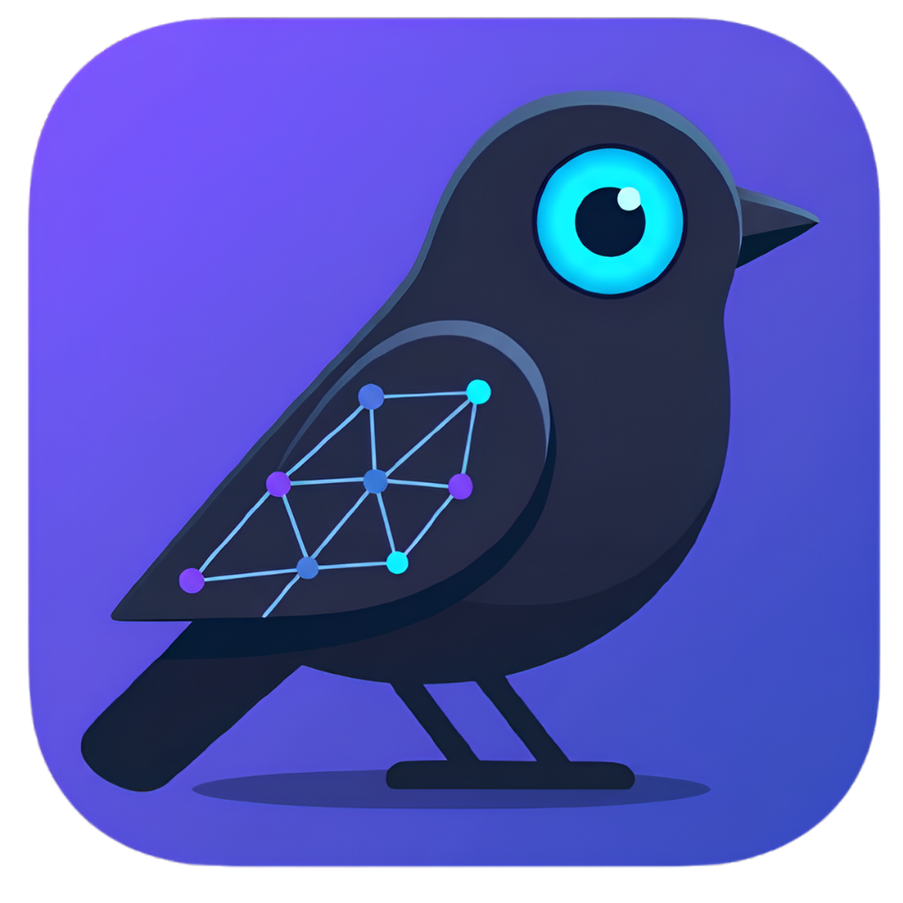
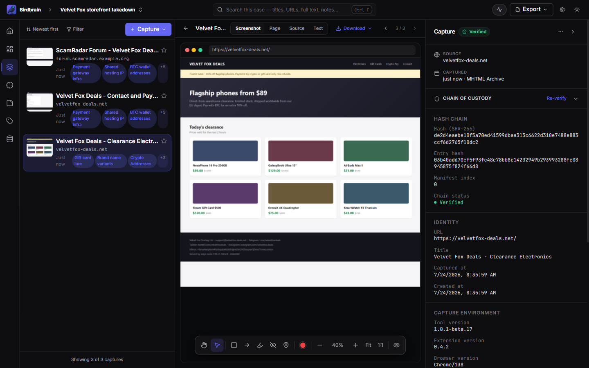
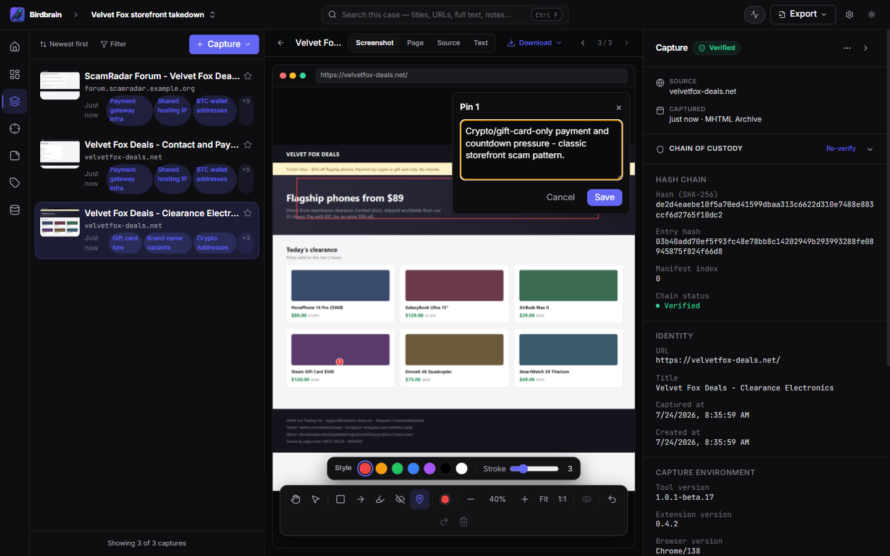
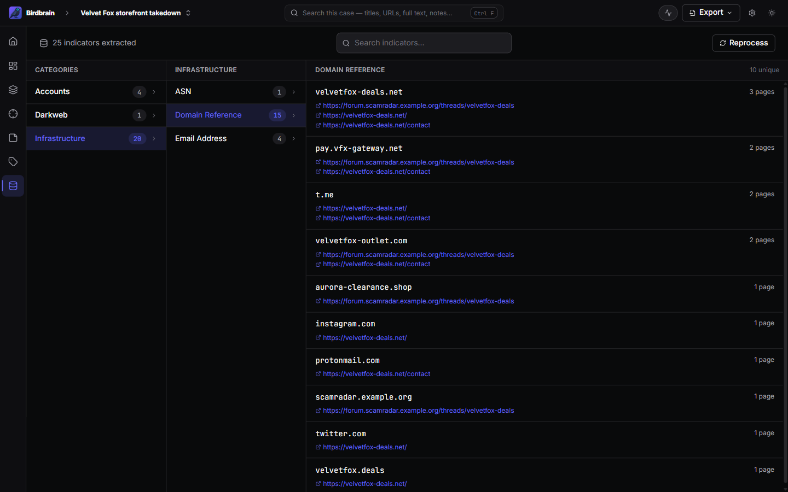
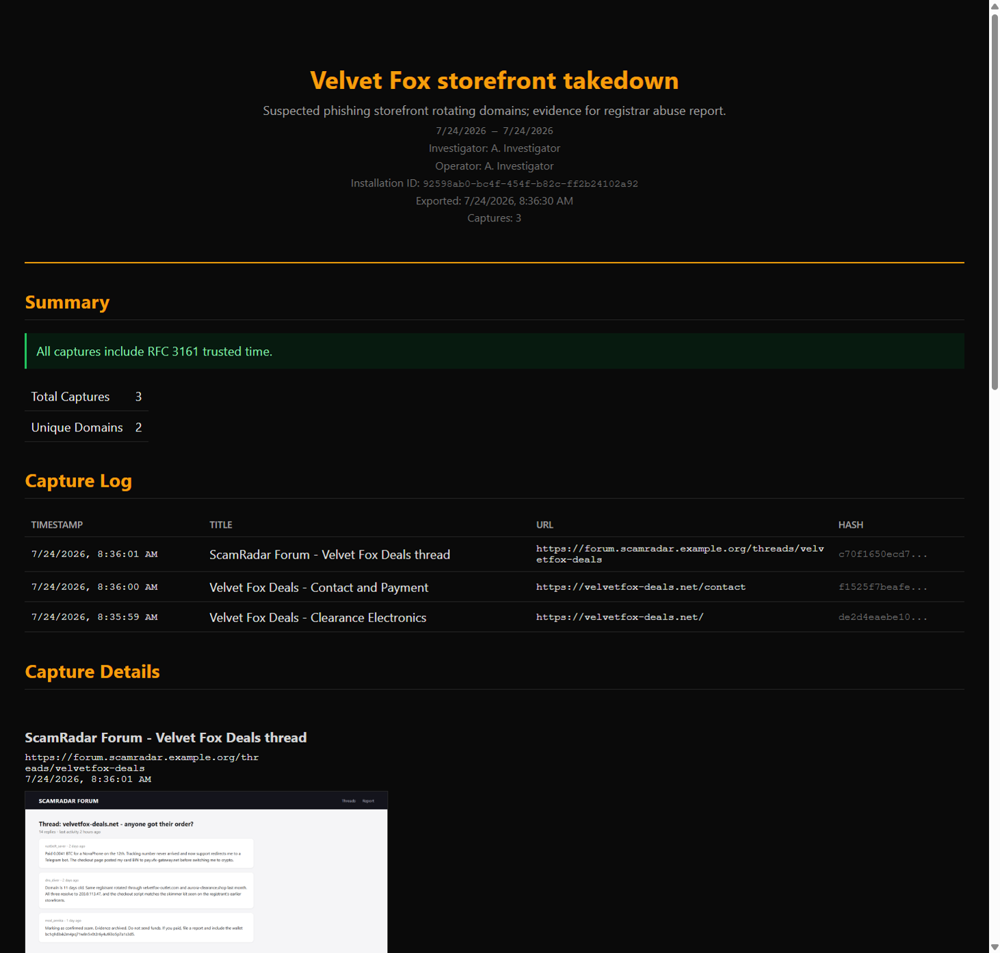

<p align="center">
  
</p>

<h1 align="center">Birdbrain</h1>

<p align="center">
  Local-first web evidence capture for OSINT investigations.<br />
  Every capture is hashed, timestamped, and chained into a verifiable audit manifest.
</p>

<p align="center">
  <a href="https://github.com/thebristolsound/birdbrain/releases/latest"></a>
  <a href="https://github.com/thebristolsound/birdbrain/actions/workflows/ci.yml"></a>
  
  <a href="LICENSE"></a>
  
</p>

---

Birdbrain is an open-source desktop app with a companion Chromium extension for capturing, organizing, and verifying web evidence. Captures include MHTML, a full-page screenshot, and extracted text, sent to the desktop app over `127.0.0.1` and stored locally in per-case archives. There is no cloud account or telemetry; captures stay on your machine unless you export them.

<p align="center">
  
</p>

## Why Birdbrain exists

OSINT capture tools that independent investigators rely on often move into enterprise platforms, add account or license-server dependencies, or stop shipping. That leaves researchers, journalists, activists, students, and small teams with fewer affordable, local-first options for preserving web evidence.

Birdbrain keeps the capture-and-prove workflow available in an MIT-licensed desktop app. The workflow is inspired by [Hunchly](https://hunch.ly/). It runs locally, avoids account and license checks, and stores evidence in formats you can inspect, export, and keep using if the project is forked.

## Features

### Capture

Save pages from a supported Chromium browser as MHTML with a screenshot and extracted page text. Captures are triggered from the extension and sent to the desktop app over `127.0.0.1`; nothing leaves your machine during capture.

### Annotate

Mark up screenshots with shapes and pinned comments. Write per-capture notes. Exported reports include the annotations with the evidence.

### Search

Search captures and notes within a case using SQLite FTS5. Define text or regex **Selectors** and Birdbrain checks them against existing and future captures, caching matches for case-wide counts.

### Recon

Birdbrain extracts indicators from each capture: IoCs (IPs, domains, hashes, CVEs), tracking pixels (GA, GTM, Facebook Pixel), social handles, `.onion` and I2P hosts, and email addresses. Browse indicators by category and open the captures where each one appeared.

### Verify + Export

Every capture is fingerprinted with SHA-256, timestamped, and chained to the previous capture in a per-case manifest. Verify the chain in-app, or export a self-contained HTML report with the manifest included. Reports are readable in any browser and verifiable without Birdbrain installed. See the [threat model](docs/reference/threat-model.md) for what these controls do — and do not — defend against.

## Screenshots

<p align="center">
  
  <em>Annotation editor — shapes and pinned comments, burned into exports</em>
</p>
<p align="center">
  
  <em>Recon — pivot from indicator category to the pages it appeared on</em>
</p>
<p align="center">
  
  <em>Verify — per-case hash chain checked in-app</em>
</p>
<p align="center">
  
  <em>Export — self-contained HTML report, verifiable without Birdbrain</em>
</p>

More screens — onboarding, dashboard, selectors, notes, tags, command palette, settings, and the extension setup guide — in the [screenshot tour](docs/reference/screenshots.md).

## Use cases

- **OSINT investigators** - case-organized capture with search, selectors, and indicator pivoting
- **Journalists, researchers, and activists** - local evidence capture on hardware you control
- **Pentesters and red teamers** - passive recon artifacts and engagement evidence with a documented chain of custody
- **CTI analysts** - extracted indicators alongside the source evidence

## Install

1. Download Birdbrain for your platform from the [latest release](https://github.com/thebristolsound/birdbrain/releases/latest) and install it.
2. Open Birdbrain. On the dashboard, click **Install Extension** — Birdbrain opens the extension folder for you.
3. Load the extension in Chrome: open `chrome://extensions`, enable **Developer mode**, click **Load unpacked**, and select the folder Birdbrain opened.
4. Pin the Birdbrain extension to your toolbar.
5. Return to Birdbrain. The dashboard walks you through creating your first case and capturing your first page.

Works with Chrome, Edge, and Brave. The extension is not on the Chrome Web Store yet, so it installs unpacked (see above).

### Linux packages and updates

Two package formats are published with each release:

- **AppImage** — self-updating. Birdbrain downloads new versions and replaces itself in place; no package manager involved.
- **deb** — also updates in-app: when an update is ready, **Restart to update** installs the new package (your system will ask for your password) and relaunches Birdbrain.

To update a deb install manually instead, download the new `.deb` and run:

```bash
sudo apt install ./birdbrain_<version>_amd64.deb
```

This upgrades in place — there is no need to remove the previous version first.

## Current limitations

Birdbrain is beta software. Current limits:

- **Search is per-case.** No cross-case search.
- **Capture is page-level.** No element selection, region screenshots, PDF, or video capture.
- **Capture is manual.** Every save is triggered from the extension — no auto-capture-on-visit.
- **Single-user, single-machine.** No shared cases, no team sync, no cloud backup.

## Contributing

Open an [issue](https://github.com/thebristolsound/birdbrain/issues) for bug reports and feature requests. For non-trivial PRs, open an issue first to discuss the approach. To report a security issue, see [SECURITY.md](SECURITY.md).

## Acknowledgements

Birdbrain uses these open-source projects:

- [ioc-extractor](https://github.com/ninoseki/ioc-extractor) — indicator extraction
- [Konva](https://konvajs.org/) — screenshot annotation canvas
- [Hono](https://hono.dev/) — local capture server
- [shadcn/ui](https://ui.shadcn.com/) + [Radix](https://www.radix-ui.com/) — UI primitives
- [better-sqlite3](https://github.com/WiseLibs/better-sqlite3) — the embedded database under every case

## Disclaimer

Birdbrain is beta software, provided as-is and without warranty of any kind. Data formats may change between releases, and the evidence workflow has not been tested in court. Do not rely on Birdbrain as your only copy of evidence that matters — verify exports and keep backups.

Birdbrain is intended for lawful investigation and research. You are solely responsible for how you use it, including compliance with applicable laws and the terms of service of any site you capture. The authors and contributors accept no liability for misuse.

## License

MIT — see [LICENSE](LICENSE).
