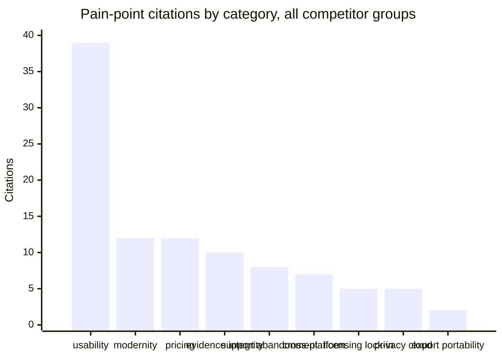
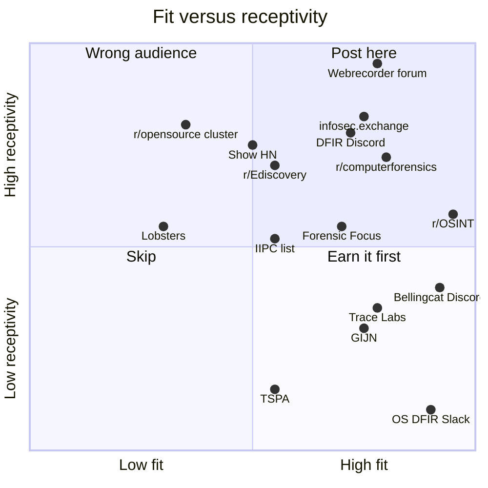
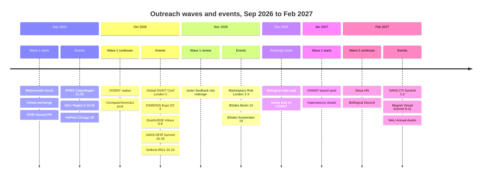

# Community outreach forecast: where Birdbrain's beta testers and first users are

<!-- vale Vale.Spelling = NO -->
<!-- Spelling is off for this file only: it names about 80 products, communities, and platforms (Webrecorder, Bellingcat, Pagefreezer, Vortimo, Zotero, pywb, and so on) and quotes user posts verbatim, misspellings included. Those names belong in .vale/styles/config/vocabularies/Birdbrain/accept.txt; adding them was out of scope for this deliverable. -->

**Date:** 2026-08-29
**Type:** Assessment
**Scope:** Online communities across four segments (OSINT and private investigation, trust and safety and archiving, journalism and fact-checking, legal and eDiscovery), primary evidence of pain points with the competitor set, and a scored forecast for two staged outreach waves.

## Summary

Wave 1 (next 1-2 months, current build) should go to five small, technical, low-risk venues: the Webrecorder community forum, OSINT and DFIR accounts on infosec.exchange, the Digital Forensics Discord's sanctioned `MemberProjects` repo, r/OSINT (replies only, because of its karma gate), and r/computerforensics, where open-source tool posts landed without removal in the week this was written.

Wave 2 (3-6 months out, after the redesign) should go where reach is: an r/OSINT launch post, the Bellingcat Discord (43,770 members), the UK Global OSINT Conference and OSMOSIS event circuit, the r/opensource, r/selfhosted, and r/electronjs cluster, and a Show HN.

The pain-point evidence is lopsided in Birdbrain's favor on three axes and against it on one. Hunchly raised its Classic price 55 percent (USD 109 to USD 169 a year) within twelve months of the Maltego acquisition, still licenses per user per year, and still refuses Firefox. Every open-source archiver has a long tail of "capture silently incomplete" and "Docker install broke" issues, and Manifest V3 forced SingleFile, WebScrapBook, and ArchiveWeb.page to migrate late and under protest. Conifer shut down in June 2026 and Vortimo is deprecated. Against Birdbrain: no user in any GitHub tracker asked for hashes, signatures, or timestamps, so the evidence-integrity pitch has to be taught rather than answered, and Webrecorder's WACZ format already has a signing and RFC 3161 spec.

Three venues are hard no's: the Open Source DFIR Slack ("Do not use for advertising your preferred tools"), r/netsec, and private-investigator association listservs, which require pre-authorization for any product mention. Eight communities on the original list are dead or gone: OSINT Curious, the IntelTechniques forum, the OSINT Industries and OSINT Editor Discord invites, Hacks/Hackers Slack, privateinvestigatorforums.com, investigator.blog, and the 0sint.social instance.

## Method and limits

Six parallel research passes ran on 2026-08-29 and 2026-08-30 UTC with `WebSearch` and `WebFetch`, plus `curl` against public JSON endpoints. Every count, price, and quote carries the date it was observed. Primary sources were preferred: the community page or API, the vendor pricing page or its Wayback snapshot, the GitHub issue, or the user's own post. A blog roundup pointed at sources but is not cited as one.

The environment set limits that shape the evidence, and the reader should weigh them:

- **Reddit was blocked** on every path (www, old, JSON API, mirrors). Reddit subscriber counts come from third-party indexes or the Arctic Shift archive API, whose figures were retrieved 2025-02-14 and are about 18 months stale. Recent-activity evidence and thread links come from Reddit's RSS and search feeds, which did work. Verbatim sidebar rules are only what an index site quoted; each is marked as such.
- **Discord member counts** come from Discord's public invite API (`/api/v9/invites/<code>?with_counts=true`) and are authoritative for that moment. Rules channels cannot be read without joining, so a rule for a Discord server is quoted only when the server publishes it elsewhere.
- **Mastodon counts** come from each instance's `/api/v1/instance` endpoint, which is the same figure the About page renders.
- **Blocked outright:** Forensic Focus (403 on every page except the feed), Trace Labs, GIJN, the Sedona Conference, DFRWS, G2, TrustRadius, LinkedIn groups (login wall), and Relativity Community (JavaScript-only shell). Findings from these are marked "not verified" or "search snippet."
- **Web search budgets** ran out in four of the six passes, so several "find one more thread" queries were not run. Where a community has no tool-discussion link, that is why.

Categories for pain points are the fixed nine from the brief: pricing, licensing/lock-in, usability, modernity, evidence integrity/admissibility, privacy/telemetry/cloud, cross-platform, export/portability, support/abandonment.

## Communities by segment

Status "alive" means a post or edit dated within the 30 days before 2026-08-29 was seen on the page or feed. "Count not visible" means the page does not render a member count to an unauthenticated fetch.

### Segment (a): OSINT, private investigators, threat intelligence, DFIR

| Community | Platform and URL | Size (date seen) | Self-promotion rule | Tool-discussion evidence | Status |
| --- | --- | --- | --- | --- | --- |
| r/OSINT | Reddit, https://www.reddit.com/r/OSINT/ | 161,661 (Arctic Shift, 2025-02-14); index sites show 164K to 248K (2026-08) | Index-quoted: posts require "minimum 20 post karma and 3-month-old account status." No explicit self-promotion rule; the karma gate is the barrier. | "Social Media Archiving" (PI asking for Hunchly alternatives, 2024-10-31, 24 comments) https://www.reddit.com/r/OSINT/comments/1gg3jlp/social_media_archiving/ ; "Tool for collecting evidence and mapping connections?" (2026-01-21) https://www.reddit.com/r/OSINT/comments/1qj9fg0/ ; 15 Hunchly threads in the search feed | Alive, newest post 2026-08-30 |
| r/computerforensics | Reddit, https://www.reddit.com/r/computerforensics/ | 72,686 (2025-02-14) | Index-quoted: "Irrelevant submissions are removed." No self-promotion text found. | "Good tool for capturing online video?" (2024-06-04) https://www.reddit.com/r/computerforensics/comments/1d81f6u/ ; open-source announcements posted 2026-08-25 to 2026-08-29 (MetaScout, Scrub) without removal | Alive, newest 2026-08-29 |
| r/digitalforensics | Reddit, https://www.reddit.com/r/digitalforensics/ | 13,124 (2025-02-14) | Approved submitters only; comments open. | A competitor ("Evidence Collector: Forensic Screenshot with Chain of Custody") announced in-sub on 2026-03-16 https://www.reddit.com/r/digitalforensics/comments/1rv7cny/ | Alive, newest 2026-08-29 |
| r/PrivateInvestigators | Reddit, https://www.reddit.com/r/PrivateInvestigators/ | 5,741 (2025-02-14) | Approved submitters only; comments open. | None found; content is consumer "find X" requests. | Alive but thin, newest 2026-08-25 |
| r/threatintel | Reddit, https://www.reddit.com/r/threatintel/ | 7,301 (2025-02-14) | Index-paraphrased: "No Advertising - Marketing material, paid features, and certification programs prohibited." | None found. | Alive but thin |
| r/cybersecurity | Reddit, https://www.reddit.com/r/cybersecurity/ | over 1M (index sites, 2026-07 and 2026-08) | Index-quoted verbatim: "All promotion ... on this subreddit must be both: Under 10% of your posts and comments on this subreddit. Once per week at most per promoted entity." | Only "Dark Web Monitoring" (2023-04-30) mentions Hunchly. | Alive |
| r/netsec | Reddit, https://www.reddit.com/r/netsec/ | 517,188 (2025-02-14) | Index-paraphrased: prohibits "commercial ads, crowdfunding" and question posts. | None. | Alive; not a fit |
| Bellingcat Discord | Discord, https://discord.com/invite/bellingcat | 43,770 members, 3,333 online (2026-08-29) | Not readable without joining. Nieman Lab (2023) describes a volunteer mod team that deletes link spam. | Bellingcat's 2025-08-13 Auto Archiver article compares Wayback, ArchiveWeb.page, and Hunchly https://www.bellingcat.com/resources/2025/08/13/the-open-source-tool-that-has-preserved-150000-pieces-of-online-evidence/ ; toolkit entry on Hunchly https://bellingcat.gitbook.io/toolkit/more/all-tools/hunchly | Alive |
| Trace Labs Discord | Discord, https://discord.com/invite/tracelabs | 29,904 members, 2,678 online (2026-08-29) | Code of Conduct (search snippet, not verified): "Trace Labs is a professional group with zero interest in anything but OSINT." | Not verifiable from outside. | Alive |
| Project Owl: The OSINT Community | Discord, https://discord.com/invite/projectowl | 50,487 members, 5,757 online (2026-08-29) | Listing page shows no self-promotion rule. Not verified. | Not verified; event-monitoring focus. | Alive; largest OSINT Discord found |
| Digital Forensics Discord Server | Discord, https://discord.com/invite/mWMJWuu | 3,933 members, 532 online (2026-08-29); a 2020 guide claims "over 10,000," discrepancy unresolved | AboutDFIR guide: members should not "spam the server with sales pitches"; "lurk for a few days to witness the culture of the server." The server's `MemberProjects` repo exists "to help promote projects made by our very own members and to support open source development." https://github.com/Digital-Forensics-Discord-Server/MemberProjects | Not verifiable from outside. | Alive |
| SANS Cyber Defense / OSINT Discord | Discord, https://discord.com/invite/mKvZzgp2FE | 6,083 members, 520 online (2026-08-29) | Not verified. | Not verified. | Alive |
| OSINT-FR | Discord, https://discord.com/invite/E2XDKNc | 30,202 members, 1,140 online (2026-08-29); French-language | Not verified. | Not verified. | Alive |
| The OSINTion | Discord, https://discord.gg/p78TTGa | 2,743 members, 207 online (2026-08-29) | Not verified. | Not verified. | Alive |
| Forensic Focus Discord | Discord, https://discord.com/invite/97zKvTXHeS | 1,137 members, 72 online (2026-08-29) | Not verified. | Not verified. | Alive, small |
| Faytuks News [OSINT] | Discord, https://discord.com/invite/faytuks | 23,945 members (2026-08-29) | Not verified. | Breaking-news monitoring; weak fit. | Alive |
| Open Source DFIR Slack | Slack, https://github.com/open-source-dfir/slack | Count not visible; invite by email with background | README verbatim: "Do not use for advertising your preferred tools." | Not applicable. | Not verified (README only) |
| Forensic Focus forums | Forum, https://www.forensicfocus.com/forums/ | Count not visible (403) | Terms (search snippet, not verified): "Spam is defined as any unsolicited advertisement"; "you may include a free link to your website in your signature." | "Website Capture Applications" thread https://www.forensicfocus.com/forums/general/website-capture-applications/ (dates not visible) | Site feed alive to 2026-08-27; forum recency not verified |
| IPIU Private Investigator Forums | Forum, https://www.ipiu.org/forums/index.php | Claims "50,000+"; not visible | Signature policy referenced; text not retrieved. | None found. | Semi-active (posts 2026-02-28); many sub-forums dormant since 2013 |
| Florida Association of Private Investigators listserv | Mailing list, https://myfapi.org/Listserv-Rules-and-Etiquette | Count not visible | Verbatim: "FAPI listserv lists may not be used for the solicitation, promotion, or sales of commercial products or services except as may be pre-authorized." Representative of PI association lists. | Not applicable. | Alive |
| infosec.exchange | Mastodon, https://infosec.exchange/ | 83,038 users, 10,547 active per month (2026-08-29) | Rule 5 verbatim: "Spam is not permitted, this includes creating spam accounts that only serve to provide profile links or advertise products and services." | Home instance of SpiderFoot, Maigret, WhatsMyName, and metaosint authors (cipher387 list). The #osint tag timeline is auth-only there. | Alive |
| UK OSINT Community Discord | Discord, invite not obtained | "1,400+" (tweet, 2026-01, search snippet) | Not verified. | Not verified. Runs the Global OSINT Conference (2026-10-05, London, sold out). | Not verified |
| Cortex XSOAR DFIR Community Slack | Slack, https://start.paloaltonetworks.com/join-our-slack-community | "more than 13,000" (search snippet); Slofile shows 166 (2016) | Not verified; vendor-run. | Not verified. | Not verified |
| OSINT Curious | Web and Discord, https://osintcurio.us/ | Discord "recently hit 10 000 members" (farewell post, 2023) | Not applicable. | Not applicable. | **Dead.** Project closed 2023-03-04. Discord status not verified; no invite published. |
| IntelTechniques forum | Forum, https://inteltechniques.com/forum/ | Not applicable | Not applicable. | Not applicable. | **Dead.** HTTP 404; shut down 2019. |
| OSINT Dojo | Web, https://www.osintdojo.com/ | No own Discord | Not applicable. | Links to other servers (OSINT Editor invite is dead). | Resource site only |
| OSINT Industries Discord | Discord, `discord.gg/OSINT` | Not applicable | Not applicable. | Not applicable. | **Dead invite** (API 404); site now links Telegram only |
| OSINT Combine community, Traceless | Web | Not found | Not applicable. | Not applicable. | **Not found** under those names |
| privateinvestigatorforums.com, investigator.blog | Forum | Not applicable | Not applicable. | Not applicable. | **Dead** (domain for sale, parked) |
| SANS DFIR mailing list | Mailing list, https://lists.sans.org/mailman/listinfo/dfir | Not applicable | Not applicable. | Not applicable. | Empty response; likely defunct, not verified |
| LinkedIn OSINT and PI groups | LinkedIn | Login-walled; no group with a visible count found | Not verified. | Not verified. | Not verified |

### Segment (b): trust and safety, disinformation research, digital archiving

| Community | Platform and URL | Size (date seen) | Self-promotion rule | Tool-discussion evidence | Status |
| --- | --- | --- | --- | --- | --- |
| Webrecorder community forum | Discourse, https://forum.webrecorder.net/ | 347 users, 441 topics, 2,234 posts; 34 active in 30 days (about.json, 2026-08-29) | No self-promotion rule. General category verbatim: "For all questions and discussion of archiving not specifically related to Webrecorder's tools" (the description goes on to invite feature requests and discussion). | "SingleFile App Integration" https://forum.webrecorder.net/t/singlefile-app-integration/760 ; "Archive signing" (WACZ signing keys, 2026-08-18, 0 replies) https://forum.webrecorder.net/t/archive-signing ; "How secure is my data on ArchiveWeb.page" https://forum.webrecorder.net/t/how-secure-is-my-data-on-archiveweb-page/696 | Alive, posts 2026-08-19 |
| ArchiveTeam | Wiki and IRC (hackint), https://wiki.archiveteam.org/index.php/Archiveteam:IRC | Count not visible | Verbatim channel rules: `#archiveteam` is "News and announcements only."; `#archiveteam-bs` is "The main Archive Team channel, for discussion of general archival." Off-topic goes to `#archiveteam-ot`. | Software page lists grab-site, wget, HTTrack, snscrape https://wiki.archiveteam.org/index.php/Software | Alive (wiki edits 2026-01) |
| r/DataHoarder, r/Archiveteam, r/Archivists | Reddit | r/Archivists 22,758 (post metadata, 2025-04-01); others not visible | Not verified. | r/Archivists: "Introducing GovArchive.us and Mirroring Entire Sites with Web Archives: Webrecorder" (2025-04-01) https://www.reddit.com/r/Archivists/comments/1jp1oip/ | r/Archivists alive (2025); others not verified |
| r/ArchiveBox | Reddit, https://www.reddit.com/r/ArchiveBox/ | Not visible | Not verified. | Latest post "where is everyone?" 2025-12-30; pinned post redirects to Zulip. | **Effectively dead**; use Zulip |
| ArchiveBox Zulip and community wiki | Zulip, https://zulip.archivebox.io/ ; wiki https://github.com/ArchiveBox/ArchiveBox/wiki/Web-Archiving-Community | 28,206 GitHub stars (2026-08-30) | Wiki already lists Hunchly ("a paid web archiving / session recording tool design for OSINT"), PageFreezer, Smarsh, Stillio. A pull request adding Birdbrain follows the existing pattern. | The wiki page is itself the evidence. | Alive |
| IIPC mailing list and Slack | Simplelists and Slack, https://netpreserve.org/about-us/iipc-mailing-list/ | Count not visible; members "from over 35 countries"; dues USD 2,590 to 11,455 a year | List is for "everyone interested in sharing information and experiences about web harvesting issues." No vendor rule. Slack is member-gated. | 2025-08-29 WAC reflections on Browsertrix and SolrWayback https://netpreserveblog.wordpress.com/ | Alive (blog 2026-06) |
| Internet Archive forums and "Internet Archive Users" Discord | Forum, https://archive.org/iathreads/forums.php ; Discord https://discord.gg/bNvf5z2xYT | Wayback forum 4,710 posts; Discord 527 members, 72 online (2026-08-29) | None found. | Not verified. | Forum alive (2026-08-29); Discord small |
| Archive-It community forum | Zendesk, https://support.archive-it.org/hc/en-us/community/topics | Not verified (403) | Not verified. | Not verified. | Not verified |
| SAA Web Archiving Section | SAA Connect list and blog, https://www2.archivists.org/groups/web-archiving-section | Count not visible; SAA membership required for the list | Membership gate only. | "A Tale of Two Tools" (Conifer versus Archive-It, 2024-02-21) https://webarchivingrt.wordpress.com/ | Section alive; blog **inactive** since 2024-08-28 |
| code4lib | Listserv, Slack, IRC, https://wiki.code4lib.org/MailingList | "Approximately 3,900 subscribers" (wiki) | Not moderated; subscribers-only posting. Job posts: "This is not discouraged, but it might be better if they were submitted to the jobs site." | 13 "webrecorder" messages 2016 to 2022 https://lists.clir.org/cgi-bin/wa?S2=CODE4LIB&q=webrecorder | Alive (archive to 2026-08) |
| glammr.us | Mastodon, https://glammr.us | 1,214 users (2026-08-29) | Rule 1 verbatim: "glammr.us is a space for folks interested in productive conversation about, well, galleries, libraries, archives, museums, memory work and records." No advertising rule. | Not verified. | Alive |
| digipres.club | Mastodon, https://digipres.club | 964 users, 224 active per month (2026-08-29) | No rules published. | #webarchiving tag: 10 posts 2026-07-06 to 2026-08-28. | Alive |
| hachyderm.io | Mastodon, https://hachyderm.io | 57,845 users, 7,424 active per month (2026-08-29) | Conduct-only rules; no self-promotion rule. | #webarchiving tag: 10 posts 2026-07-17 to 2026-08-28. | Alive |
| Trust and Safety Professional Association (TSPA) | Paid membership and Slack, https://www.tspa.org/become-a-member/ | Count not visible | Eligibility excludes "business development, marketing, partnership management, sales." No explicit vendor rule; the role exclusion is the gate. | Not verified. | Alive (TrustCon 2026 held) |
| Integrity Institute | Vetted membership, https://integrityinstitute.org/membership | "600+ members" from "80+ platforms" | Code of Conduct verbatim: members "should not use digital spaces, tools, or the membership directory for purposes of excessive spam and self-promotion." Requires 6 months of platform integrity experience. | Not verified. | Alive |
| Trust and Safety Foundation | Research coalition, https://www.trustandsafetyfoundation.org/programs | Count not visible | None; has a Tooling Research Committee and an open matchmaking form. | Not verified. | Alive |
| All Tech Is Human Slack | Slack, https://alltechishuman.org/ | "over 10,000 members across more than 100 countries" | Code of Conduct exists; no promotion rule quoted. | Not verified. | Alive |
| r/trustandsafetypros | Reddit | "1K+" (secondary) | Not verified. | Not verified. | Not verified |
| EU DisinfoLab | Conference and newsletter, https://www.disinfo.eu/conference/ | #Disinfo2026 capped at 650 participants; EUR 180 NGO rate | Tool vendors sponsor (Filigran, Blackbird AI, Storyzy). | Not applicable. | Alive (Vilnius, 2026-10-06 to 08) |
| GNET / EGRN | Research network, https://gnet-research.org/what-we-do/ | "over 180 global members" | Research pledge; no promotion rule. | Not applicable. | Alive |
| Information Futures Lab, Meedan, Digital Methods Initiative, Digital Preservation Coalition | Institutions | No open community found | Not applicable. | Not applicable. | Alive as organizations; no forum |
| Archives Unleashed, Credibility Coalition, Stanford Internet Observatory | Web | Not applicable | Not applicable. | Not applicable. | **Inactive** (2023, 2017, dissolved 2024) |

### Segment (c): journalists and fact-checkers

| Community | Platform and URL | Size (date seen) | Self-promotion rule | Tool-discussion evidence | Status |
| --- | --- | --- | --- | --- | --- |
| Bellingcat Discord and Volunteer Community | Discord and cohort program, https://www.bc-community.org/ | See segment (a); volunteer community "over 100 active members" | Volunteer rules: 18+, no military or police, real-name bylines. | See segment (a). | Alive; Spring 2026 cohort closed |
| GIJN | Member network and help desk, https://gijn.org/ | "more than 200 member organizations in over 80 countries"; no individual membership | Editorial, not a forum. | Tool roundups recommend Hunchly and Wayback (search snippet; site 403) https://gijn.org/2021/08/18/investigative-tools-that-reporters-love | Alive (GIJC25 held) |
| IRE listservs (IRE-L, NICAR-L) | LISTSERV, https://www.ire.org/resources/listservs/ | "more than 2,300 members" for NICAR-L (search snippet, not verified) | Verbatim: "All IRE's listservs are subject to the IRE Code of Conduct." IRE-L and NICAR-L are open to non-members. | Not verified. | List server unreachable; not verified |
| IFCN Slack and listservs | Slack, https://ifcncodeofprinciples.poynter.org/signatory-benefits | "more than 170 fact-checking organizations" | Verbatim: "This listserv is dedicated exclusively to signatories of the IFCN Code of Principles." The community list "is open to the entirety of the larger fact-checking community." | Not verified. | Alive |
| journa.host | Mastodon, https://journa.host | 2,936 users (2026-08-29) | Rule 6 verbatim: "This is a server for journalists. If you are not a journalist, please look to one of the many other servers that exist." | Not verified. | Alive |
| r/Journalism and its Discord | Reddit and Discord | Not verified (blocked) | Not verified. | Not verified. | Not verified |
| Hacks/Hackers Slack | Slack, https://hackshackers.com/ | Not applicable | Not applicable. | Not applicable. | **Dead** (join page 404; homepage lists newsletter and Luma events only) |
| Lighthouse Reports, Forensic Architecture, Mnemonic | Institutions | No open community | Not applicable. | Not applicable. | Fellowship or contact-form engagement only |

### Segment (d): legal, eDiscovery, compliance, litigation support

| Community | Platform and URL | Size (date seen) | Self-promotion rule | Tool-discussion evidence | Status |
| --- | --- | --- | --- | --- | --- |
| r/Ediscovery | Reddit, https://www.reddit.com/r/Ediscovery/ | Count not visible | Not verified. A maker post ("I built a free in-browser checker for DAT/OPT/LFP/DII load files" on 2026-08-25) was live, so builder posts are tolerated. | "Apps for Web and Social Media Capture" (2022-02-15) https://www.reddit.com/r/ediscovery/comments/st4oqc/ ; "Social Media Collections" (2026-07-13) https://www.reddit.com/r/ediscovery/comments/1uvk3lt/ ; "Collection/Review of Social Media Data" (2025-06-13) https://www.reddit.com/r/ediscovery/comments/1lao6ij/ | Alive, newest 2026-08-29 |
| r/legaltech | Reddit | Count not visible | Not verified. | "screenshot evidence" search: 0 hits; feed is AI practice tools. | Alive |
| r/paralegal | Reddit | Count not visible | Not verified; "I made some free legal tools" (2026-08-29) was live. | None on capture tooling. | Alive |
| r/Lawyertalk | Reddit | Count not visible | Not verified. | None. | Alive; not a fit |
| The Sedona Conference Working Group Series | Paid membership, https://thesedonaconference.org/wgs | "seven active Working Groups"; USD 495 a year | Not a posting venue; content "disabled for non-members." | Produces commentaries, not threads. | Alive; WG1 meeting 2026-10-22 (search snippet, not verified) |
| ACEDS | Association and LinkedIn group, https://aceds.org/ | LinkedIn group "over 10,000" (TERIS, 2021, secondary) | Professional membership USD 99; vendors enter as affiliate partners. | None found. | Alive |
| EDRM | Community and LinkedIn group, https://edrm.net/ | "19 active projects"; LinkedIn "over 4,500" (2021, secondary) | "no membership fees for participants and all are welcome"; project participation by application. | No web-capture project. | Alive |
| ILTA | Association, https://www.iltanet.org/ | "26,000+" and "25,000+" on two pages (site disagrees with itself) | Vendors join as "Industry Participant $500 USD"; forum posting rules login-gated. | Litigation Support community exists; login-gated. | Alive |
| eDiscovery Today | Blog, https://ediscoverytoday.com/ | No forum | Not applicable. | "Screenshots as Evidence, Do Courts Accept It?" (2022-06-16) https://ediscoverytoday.com/2022/06/16/screenshots-as-evidence-do-courts-accept-it-ediscovery-case-law/ ; Wayback not self-authenticating (2022-04-25) | Alive (2026-08-28) |
| LinkedIn eDiscovery groups (Electronic Discovery Group, Litigation Support Professionals, others) | LinkedIn | "More than 12,000" for Electronic Discovery Group (2021, secondary) | Not verified (login wall). | Not verified. | Not verified |
| Relativity Community | Salesforce site | Not verified (renders nothing) | Not verified. | Not verified. | Unknown |
| IAPP | Association, https://iapp.org/ | "90,000+ Members" | Membership-gated; no online forum found. | None; privacy focus. | Alive; weak fit |
| Sidebar (formerly LawyerSmack) | Private Slack-style community, https://sidebar.net/ | "over 10,000 messages weekly"; about USD 199 a year | Lawyers only; vendor rules not shown. | Not verified. | Alive |
| Forensic Focus legal section, Legal Hackers, Above the Law, Legal Talk Network | Various | Not applicable | Not applicable. | Not applicable. | No reader community or forum found |

### General-tech launch venues

| Venue | Platform and URL | Size (date seen) | Self-promotion rule | Prior archiving-tool threads | Status |
| --- | --- | --- | --- | --- | --- |
| Hacker News (Show HN) | https://news.ycombinator.com/showhn.html | Not applicable | Verbatim: "Show HN is for something you've made that other people can play with." "Please make it easy for users to try your thing out, ideally without barriers such as signups or emails." "If your work isn't ready for users to try out, please don't do a Show HN." | ArchiveBox 669 points (2024-10-16) https://news.ycombinator.com/item?id=41860909 ; SingleFile 958 points (2022-03-02); monolith Show HN 640 points (2019-08-23); Webrecorder 458 points (2020-05-11); "Show HN: OsintRadar" 83 points (2026-04-05). Hunchly never ranked (best 3 points). | Alive |
| Lobsters | https://lobste.rs/about | Invite-only | Verbatim: "As a rule of thumb, self-promo should be less than a quarter of one's stories and comments." | ArchiveBox 32 points (2020-12-02); "SingleFile Web Extension" 21 points, 8 comments (2026-03-04) | Alive |
| fosstodon.org | Mastodon | 62,700 users, 7,240 active per month (2026-08-29); invite-only | Verbatim: "DO NOT post commercial promotions, or advertise" | #osint tag: 10 posts dated 2026-08-29 and 30 | Alive |
| mastodon.social #osint | Mastodon | Not applicable | Instance rules only | 10 posts dated 2026-08-30 | Alive |
| 0sint.social | Mastodon | Not applicable | Not applicable | Not applicable | **Dead** (no DNS record) |
| r/opensource, r/selfhosted, r/electronjs | Reddit | Counts not visible | Not verified; feeds are dominated by "I built X" posts (Whatiff 2026-08-29, Invoxa 2026-08-30, Cadence on r/electronjs 2026-08-26 https://www.reddit.com/r/electronjs/comments/1vyxlno/ ) | "How to save web pages by offline?" (r/opensource, 2024-03-16) https://www.reddit.com/r/opensource/comments/1bg6z2l/ | Alive |
| r/privacy | Reddit | Count not visible | Not verified; feed is news and questions, no maker posts seen. | None. | Alive; weak fit |
| alternativeto.net | Directory, https://alternativeto.net/software/hunchly/ | Hunchly page lists "3 of 3" alternatives (historious, HEAP, Proofsnap); Pagefreezer page lists 33 (SingleFile 129 likes, ArchiveBox 87, Wayback 346) | Open submissions. | The listing itself. | Alive; Hunchly page nearly empty |
| Product Hunt | Directory, https://www.producthunt.com/products/hunchly | Hunchly: 5 votes, "No reviews yet" (2016) | Not applicable. | Not applicable. | Dead surface for this category |

## Pain points by competitor group

Quotes are verbatim and under 30 words; the date is the post's date. Where the source page could not be fetched and the wording comes from a search snippet, the row says "not verified."

### Paid forensic capture

Current list prices, all fetched 2026-08-29:

| Vendor | Price shown | Source |
| --- | --- | --- |
| Hunchly Classic | "EUR 149 / yr, USD 169 / yr"; Free tier "No credit card required"; Cloud and multi-license "Contact Sales" | https://hunch.ly/pricing |
| Pagefreezer | No public price; pricing page 404; Capterra "Contact vendor for pricing" | https://www.capterra.com/p/146271/PageFreezer/ |
| WebPreserver | No public price; Chrome listing requires "a paid WebPreserver subscription" | https://chromewebstore.google.com/detail/webpreserver/ebofmienemijnilnonphmmmahgmnpflh |
| Magnet Web Page Saver | Free; the page gives v3.3 as released 2020-09-17 | https://www.magnetforensics.com/resources/web-page-saver/ |
| Vortimo / OSINT-Tool | "Premium $ 750 per year" (Wayback 2023-11-29, unchanged 2026-04-17); Vortimo pricing page now a deprecation notice | http://web.archive.org/web/20260417215701/https://www.osint-tool.com/buy/ |
| Forensic OSINT | Essential USD 49 a month or USD 197 a year; Elite USD 109 a month or USD 1,097 a year (read from the embedded Stripe pricing table) | https://www.forensicosint.com/pricing |
| Paliscope | No public price; pricing page 404 | https://www.paliscope.com/ |
| Page Vault | Browser plans "Request Pricing"; On Demand "Websites start at $199"; Capterra lists "$195 per user, per month" | https://www.page-vault.com/pricing/ |
| Maltego Graph (substitute) | Basic EUR 0; Entry EUR 3,000 a year; Professional EUR 7,500 a year, "Up to 5 users (billed per seat)" | https://www.maltego.com/pricing/ |

Hunchly price history from Wayback snapshots of `hunch.ly` and `hunch.ly/pricing`, all fetched 2026-08-29:

| Snapshot date | Price shown |
| --- | --- |
| 2017-02-14 | "1 license ... $129.99"; "3 licenses ... $349.99" |
| 2018-01-10 through 2024-02-02 | "$129.99 / year ... Use on as many of your computers or VMs as you need!" |
| 2024-09-07 | "Classic $109.99 / yr." and "Cloud $199.99 / yr." |
| 2025-06-23 (after the Maltego acquisition, closed 2025-05-16) | "Classic EUR 99.00 USD 109.99"; "Cloud EUR 179 / yr." |
| 2025-09-22 to 2026-01-11 | "Classic EUR 99 / yr, USD 109 / yr"; Cloud no longer priced |
| 2026-05-25 | "Classic EUR 149 / yr, USD 169 / yr" |

The price was flat for seven years, dipped when Cloud launched, and rose 55 percent in USD between 2026-01-11 and 2026-05-25. Cloud moved from a public USD 199.99 a year to "Contact Sales." Third-party pages (einvestigator.com, dated 2024-12-29) still quote USD 129.99.

| # | Tool | Category | Quote or fact | Source and date |
| --- | --- | --- | --- | --- |
| P1 | Hunchly | pricing | Classic rose from "$109 USD / yr" to "$169 USD / yr" between the 2026-01-11 and 2026-05-25 snapshots. | http://web.archive.org/web/20260525202714/https://hunch.ly/pricing (2026-05-25) |
| P2 | Hunchly | pricing | Cloud was "$199.99 / yr." in 2024 and is "Contact Sales" now. | http://web.archive.org/web/20240907052437/https://hunch.ly/pricing ; https://hunch.ly/pricing (2026-08-29) |
| P3 | Hunchly | licensing/lock-in | "Hunchly licenses are annual and per user." | https://support.hunch.ly/article/80-how-does-hunchly-licensing-work (2026-08-29) |
| P4 | Hunchly | licensing/lock-in | Activation is by an emailed `.hlic` license file uploaded in the dashboard. | https://docs.maltego.com/en/support/solutions/articles/15000061296-how-to-activate-hunchly (2026-08-29) |
| P5 | Hunchly | modernity | "Unfortunately, we are unable to support Firefox because it is missing features that Hunchly needs." | https://support.hunch.ly/article/39-7-does-hunchly-work-on-chromium (2026-08-29) |
| P6 | Hunchly | cross-platform | Linux is "Ubuntu 22.04 LTS 64bit or newer" with a `.deb` package only; Kali and Trace Labs builds "may require more effort." | https://support.hunch.ly/article/15-installing-hunchly-on-linux (2026-08-29) |
| P7 | Hunchly | cross-platform | "Hunchly support for Intel-based Macs will end in September 2027" | https://support.hunch.ly/article/126-sep-2027-support-ending-for-intel-based-macs (updated 2026-07-09) |
| P8 | Hunchly | cross-platform | "Has anyone gotten it to work on Linux on a CHROMEBOOK?" | https://chromewebstore.google.com/detail/hunchly-20/amfnegileeghgikpggcebehdepknalbf/reviews (2018-10-11) |
| P9 | Hunchly | privacy/telemetry/cloud | Hunchly Cloud is "15 gb of storage per user" hosted on Oracle Cloud (Toronto, Frankfurt). | https://support.hunch.ly/article/112-3-hunchly-cloud-faq (2026-08-29) |
| P10 | Hunchly | export/portability | PDF export differs from the page; the vendor's workaround is "Export to MHTML format instead." | https://support.hunch.ly/article/33-why-does-the-pdf-export-look-different-from-the-original-page (2026-08-29) |
| P11 | Hunchly | evidence integrity/admissibility | "Videos will be archived as screenshots"; "Non-continuous Page IDs may complicate legal proceedings" | https://bellingcat.gitbook.io/toolkit/more/all-tools/hunchly (undated, community-maintained) |
| P12 | Hunchly | usability | Storage growth "requiring significant local disk space or paid cloud storage" | https://bellingcat.gitbook.io/toolkit/more/all-tools/hunchly (undated) |
| P13 | Pagefreezer | pricing | No public price anywhere on the site; Capterra: "Contact vendor for pricing." | https://www.capterra.com/p/146271/PageFreezer/ (2026-08-29) |
| P14 | Pagefreezer | modernity | "Too-frequent changes in social media platforms requirements can interrupt social media capture on Pagefreezer." | https://www.capterra.com/p/146271/PageFreezer/reviews/ (2022-06-30) |
| P15 | Pagefreezer | usability | Dislike: "Intergration into the platform for billing and invoice management." | https://www.capterra.com/p/146271/PageFreezer/reviews/ (2020-10-06) |
| P16 | Pagefreezer | usability | "Little slow" (G2, search snippet only; page returned 403, not verified) | https://www.g2.com/products/pagefreezer/reviews |
| P17 | WebPreserver | licensing/lock-in | "Asks you to sign up but doesn't even give you an option to - just takes you to their wesbite???" | https://chromewebstore.google.com/detail/webpreserver/ebofmienemijnilnonphmmmahgmnpflh/reviews (2024-04-04) |
| P18 | WebPreserver | licensing/lock-in | "when you fill the form and download extension, you find out that there is a login form" | same, 2021-02-25 |
| P19 | WebPreserver | privacy/telemetry/cloud | "Nah, not creating yet another account on my computer just to use a screenshot app." | same, 2020-07-17 |
| P20 | WebPreserver | usability | "Useless Extension" (1 star); listing shows 3.1 stars from 9 ratings, 4,000 users. | same, 2024-05-18; listing 2026-08-29 |
| P21 | Magnet Web Page Saver | support/abandonment | Still listed as free; the page gives v3.3 as released 2020-09-17. No update in six years and no retirement notice. | https://www.magnetforensics.com/resources/web-page-saver/ (2026-08-29) |
| P22 | Vortimo | support/abandonment | Vendor: "Two of them are deprecated now. The third one is in use, and it's called Ubikron." Vortimo was "too complex, too much data, too heavy on client compute platform"; Ubikron is "Beta Closed." | https://www.vortimo.com/pricing ; https://ubikron.com/ (2026-08-29) |
| P23 | Vortimo | pricing | "this extension can only be used for 30 minutes without a subscription of at least $8 per month." | https://chromewebstore.google.com/detail/vortimo-osint-tool/mnakbpdnkedaegeiaoakkjafhoidklnf/reviews (2024-05-20) |
| P24 | Vortimo | usability | "This should not automatically be on all sites... annoying popup that i cant see a good way to turn off" | same, 2024-12-07 |
| P25 | Vortimo | evidence integrity/admissibility | "the tool injects JavaScript in every single page you visit" so the "source of the web page itself does actually change" | https://sector035.nl/articles/review-vortimo (2021-10-05) |
| P26 | Forensic OSINT | pricing | Essential USD 197 a year; Elite USD 1,097 a year (Stripe pricing table). | https://www.forensicosint.com/pricing (2026-08-29) |
| P27 | Forensic OSINT | pricing | "paid plan for a screen shot taker ? use go full page app its free and better" | https://chromewebstore.google.com/detail/forensic-osint-full-page/jojaomahhndmeienhjihojidkddkahcn/reviews (2025-05-02) |
| P28 | Forensic OSINT | privacy/telemetry/cloud | Chrome "privacy error upon logging in saying 'Forensic OSINT Full Page Screen Capture was added remotely'" (developer rebutted) | same, 2025-07-20 |
| P29 | Paliscope | support/abandonment | YOSE and Discovry renamed to Explore and Build; vendor: "we haven't always communicated as clearly as we should." No public price. | https://www.paliscope.com/discovry-24-3-release-2/ (2024-10-02) |
| P30 | Page Vault | pricing | Capterra "$195 per user, per month"; On Demand "Websites start at $199" and social media "$349" | https://www.page-vault.com/pricing/ ; https://www.capterra.com/p/158127/Page-Vault/ (2026-08-29) |
| P31 | Page Vault | usability | "I wish there was a Chrome extension so that it was a little easier to make a preservation." | https://www.capterra.com/p/158127/Page-Vault/ (2018-06-13) |
| P32 | Page Vault | usability | "Sometimes slow with large searches on Facebook" | same, 2022-08-24 |
| P33 | ArchiveSocial | support/abandonment | Pricing page redirects to CivicPlus: "ArchiveSocial is now owned by CivicPlus"; "Request pricing" only. | https://www.civicplus.com/social-media-archiving/ (2026-08-29) |

Not found, and worth saying so: no negative Hunchly thread exists on Hacker News (best story 3 points), and Reddit, X, and LinkedIn were unreachable, so Hunchly's user-voiced complaints are limited to the Chrome Web Store and the Bellingcat toolkit. Hunchly's Manifest V3 status is not verified: no blog or changelog is reachable and the support search for "manifest" returns nothing. The extension listing shows v2.6.2, updated 2026-06-30, 10,000 users, 5.0 stars from 7 ratings.

### Open-source archivers

| # | Tool | Category | Quote | Source and date |
| --- | --- | --- | --- | --- |
| O1 | ArchiveBox | usability | "In practice, I have never been able to make it work, across multiple attempts on both Linux and Windows... And then it always stops." | https://news.ycombinator.com/item?id=38981227 (2024-01-13) |
| O2 | ArchiveBox | usability | "Immediately some archival methods fail (usually screenshot and pdf), and after archiving a few hundred bookmarks it never continues" | https://news.ycombinator.com/item?id=36947701 (2023-07-31) |
| O3 | ArchiveBox | usability | "the headless Chromium they use has some annoying 'will break randomly and GFL trying to figure out why/how to fix it' problems" | https://news.ycombinator.com/item?id=45897953 (2025-11-12) |
| O4 | ArchiveBox | usability | "Unfortunately this seems to break my install every time so I'm having a very difficult time troubleshooting." (Docker Compose update) | https://github.com/ArchiveBox/ArchiveBox/issues/1276 (2023-11-24) |
| O5 | ArchiveBox | usability | "the dev image still doesn't work as you suggest. When I try to run it in a new and completely empty folder the init fails" | https://github.com/ArchiveBox/ArchiveBox/issues/1528 (2024-10-04) |
| O6 | ArchiveBox | usability | "anything that relies on Chromium rendering, times out on some reddit.com pages." | https://github.com/ArchiveBox/ArchiveBox/discussions/1022 (2022-09-11) |
| O7 | ArchiveBox | usability | Cookie file supplied, "but when I try to archive a page like reddit or youtube... they still appear in the archive" as login walls. | https://github.com/ArchiveBox/ArchiveBox/issues/1637 (2025-01-19) |
| O8 | ArchiveBox | usability | "Error 1010: The owner of this website has banned your access based on your browser's signature."; maintainer: "forever going to be cat and mouse with providers like Cloudflare" | https://github.com/ArchiveBox/ArchiveBox/issues/997 (open since 2022-07-12) |
| O9 | ArchiveBox | usability | Maintainer on paywalls: "effectively require paying for an account and reusing the paying account credentials for archiving." | https://github.com/ArchiveBox/ArchiveBox/issues/1507 (2024-09-05) |
| O10 | ArchiveBox | cross-platform | README: "Installing directly on Windows without Docker or WSL/WSL2/Cygwin is not officially supported (I cannot respond to Windows support tickets)" | https://github.com/ArchiveBox/ArchiveBox#readme (2026-08-30) |
| O11 | ArchiveBox | usability | "The main web page is really hard to follow for me." | https://github.com/ArchiveBox/ArchiveBox/issues/1350 (2024-02-18) |
| O12 | ArchiveBox | evidence integrity/admissibility | ArchiveBox has "no cryptographic signature linking the WARC to the time it was captured" (search snippet; page 403, not verified) | https://osintteam.blog/build-your-own-wayback-self-hosting-archivebox-for-osint-evidence-why-and-how-43eb6d46e327 (2026-06) |
| O13 | SingleFile | modernity | Author: "Extension development with Manifest V3 is a real pain"; "So I'm waiting until the last moment to migrate." | https://github.com/gildas-lormeau/SingleFile/discussions/1352 (2023-12-20) |
| O14 | SingleFile | modernity | Author: "I will publish it on the stores of Edge and Chrome when I will have no other choice." | https://github.com/gildas-lormeau/SingleFile/issues/1434 (2024-04-10) |
| O15 | SingleFile | modernity | Author, on the MV3 API: "this API will not provide anything beneficial for SingleFile." | https://github.com/gildas-lormeau/SingleFile/issues/312 (2020-01-10) |
| O16 | SingleFile | modernity | "I just noticed that Chrome Web Store no longer supports SingleFileZ and prompted me to remove it." | https://github.com/gildas-lormeau/SingleFileZ/issues/194 (2025-03-05) |
| O17 | SingleFile | modernity | "after the latest Chrome update... it appears that Singlefile has stopped working properly" | https://chromewebstore.google.com/detail/singlefile/mpiodijhokgodhhofbcjdecpffjipkle/support (2025-09-23) |
| O18 | SingleFile | modernity | On SingleFile Lite: "the battle station did not 'go poof' in that scene, though, like singlefile-lite does, thanks to manifest v3." | https://news.ycombinator.com/item?id=33064625 (2022-10-03) |
| O19 | SingleFile | usability | Police cyber-centre officer saving evidence from Twitter: "it only saves one part" | https://github.com/gildas-lormeau/SingleFile/issues/440 (2020-07-08) |
| O20 | SingleFile | usability | "the resulting saved page is truncated way before the end is reached, so only perhaps 5% has text"; author (2026-08-27): "SingleFile saves the page as it is, so it cannot save them." | https://github.com/gildas-lormeau/SingleFile/issues/1744 (2025-06-04, open) |
| O21 | SingleFile | usability | "after downloading the file, the filename will be like this d236fc55-6c99-46b1-813a-383af840337f.htm" | https://forum.vivaldi.net/topic/98289/singlefile-plugin-not-working-properly (2024-05-30) |
| O22 | ArchiveWeb.page | modernity | Maintainer on MV3: "There are some questions that remain regarding the debugger being attached." Issue opened 2023-01-10; MV3 shipped in v0.12.0 on 2024-06-04. | https://github.com/webrecorder/archiveweb.page/issues/131 (2023-01-15) |
| O23 | ArchiveWeb.page | modernity | Fork submitting to the store: "Want to share few obstacles we are facing regarding usage of eval in the code" | same, 2023-08-31 |
| O24 | ArchiveWeb.page | evidence integrity/admissibility | "the application seems to get stuck randomly without any noticeable cause"; pages recorded with an empty timestamp. | https://github.com/webrecorder/archiveweb.page/issues/338 (2025-12-29) |
| O25 | ArchiveWeb.page | usability | "when I replayed a page, I noticed some pictures weren't loading" | https://github.com/webrecorder/archiveweb.page/issues/285 (2024-12-31, open) |
| O26 | ArchiveWeb.page | usability | "I press archive and then the page opens and the app crashes." | https://github.com/webrecorder/archiveweb.page/issues/345 (2026-02-18, open) |
| O27 | ArchiveWeb.page | usability | "Sorry, there was an error starting recording on this page." (login-walled site) | https://github.com/webrecorder/archiveweb.page/issues/190 (2023-09-20) |
| O28 | ArchiveWeb.page | cross-platform | "And Webrecorder doesn't have a Firefox extension" (issue #16 open since 2021) | https://news.ycombinator.com/item?id=42799571 (2025-01-23) |
| O29 | Conifer | support/abandonment | "In June 2026, a tombstone web application will replace Conifer." Webrecorder tooling "can no longer be meaningfully integrated into the hosted service." | https://blog.conifer.rhizome.org/2025/12/15/twilight-announcement.html (2025-12-15) |
| O30 | Conifer | support/abandonment | Webrecorder: "Conifer's approach to archiving is no longer sustainable" | https://webrecorder.net/blog/2025-12-18-conifer-twilight/ (2025-12-18) |
| O31 | Wayback SPN | usability | "the extension seems to take between 7 and 9 days to display the error" (429 handling) | https://github.com/internetarchive/wayback-machine-webextension/issues/1110 (2026-03-18, open) |
| O32 | Wayback SPN | usability | "I get a 'Save Failed' error when I try to save a webpage... after hitting the rate limit." | https://github.com/internetarchive/wayback-machine-webextension/issues/1071 (2025-05-27; "Still an issue" 2026-01-08) |
| O33 | Wayback SPN | usability | Blogger sites "getting an 'unreachable' message for all attempts to save for the past week." | https://github.com/internetarchive/wayback-machine-webextension/issues/1063 (2025-03-07, open) |
| O34 | Wayback SPN | usability | "Save Page Now could not capture this URL because it was unreachable. If the site is online, it may be blocking access from our service." | https://news.ycombinator.com/item?id=44389376 (2025-06-26) |
| O35 | Wayback SPN | usability | Internet Archive help: "Javascript elements are often hard to archive"; site owners may have "requested that their sites be excluded." | https://help.archive.org/help/using-the-wayback-machine/ (2026-08-30) |
| O36 | Wayback SPN | evidence integrity/admissibility | Fifth Circuit, *Weinhoffer v. Davie Shoring* (2022): "a private internet archive falls short of being a source whose accuracy cannot reasonably be questioned" | https://ediscoverytoday.com/2022/04/25/wayback-machine-evidence-not-self-authenticating-rules-fifth-circuit-ediscovery-case-law/ (2022-04-25) |
| O37 | Wayback SPN | evidence integrity/admissibility | Australia, *JWR Productions v Duncan-Watt (No 2)* [2020]: "Absent some explanation as to the operation of the Wayback Machine website and how its data is collected and held, they are not evidence" | https://www.nortonrosefulbright.com/en/knowledge/publications/57e50249/using-screenshots-from-the-wayback-machine-in-court-proceedings (2021-10) |
| O38 | Wayback SPN | privacy/telemetry/cloud | October 2024 DDoS and breach; archive.org came back "in a read-only manner" on 2024-10-21. | https://blog.archive.org/2024/10/21/internet-archive-services-update-2024-10-21/ (2024-10-21) |
| O39 | Monolith | usability | "the file output does not contain the table I have in the source web page" | https://github.com/Y2Z/monolith/issues/319 (2022-09-24) |
| O40 | Monolith | usability | "We have some workloads that require saving pages that have some click actions." (no JS engine; open, no reply) | https://github.com/Y2Z/monolith/issues/378 (2024-03-31) |
| O41 | Monolith | usability | "Twitter's doing redirects and JS detection that thwarts monolith" | https://github.com/Y2Z/monolith/issues/204 (2020-07-25) |
| O42 | Monolith | export/portability | "Too bad that fully offline is not an option." (JS-heavy pages still pull remote assets) | https://github.com/Y2Z/monolith/issues/19 (2021-09-13) |
| O43 | grab-site | usability | "I get stuck on the last command in step 2 for Linux installation"; follow-up: "it still does not work... i kinda gave up" | https://github.com/ArchiveTeam/grab-site/issues/246 (2025-04-26, 2025-06-23) |
| O44 | grab-site | support/abandonment | "Python 3.8 officially reached its end of life on October 7, 2024 and is disabled in Homebrew"; contributor: "it's turning into a 'give a mouse a cookie' / onion-peeling scenario." | https://github.com/ArchiveTeam/grab-site/issues/245 (2025-04-13, 2025-09-05) |
| O45 | grab-site | cross-platform | README section titles: "Install on another distribution lacking Python 3.7.x or 3.8.x"; "Install on Windows 10 (experimental)" | https://github.com/ArchiveTeam/grab-site#readme (2026-08-30) |
| O46 | pywb | cross-platform | "pywb fails to load on macOS 11.0 Big Sur due to an issue with fakeredis" (open since 2021) | https://github.com/webrecorder/pywb/issues/616 (2021-02-08) |
| O47 | pywb | usability | User wrote a from-scratch dependency recipe for Arch-family Linux and asks that it be documented. | https://github.com/webrecorder/pywb/issues/993 (2026-04-12) |
| O48 | pywb | usability | "Documentation does not cover rules.yaml / HTML rewrite rules" | https://github.com/webrecorder/pywb/issues/784 (2022-12-07, open) |
| O49 | WebScrapBook | modernity | Maintainer: "We'll do that as late as possible. In short: MV3 sucks." | https://github.com/danny0838/webscrapbook/issues/377 (2024-04-04) |
| O50 | WebScrapBook | modernity | "The released version in Chrome Web Store is MV3 since v2.24, since there is no way to configure the browser to allow MV2 extenstions ... since GC 140." | same, 2025-09-17 |

Two findings from the absence of evidence. First, a search of the SingleFile and ArchiveBox trackers for the terms hash, timestamp, signature, provenance, and chain of custody (2026-08-30) returned only filename-digest features; no user asked for evidence integrity. Second, Webrecorder's WACZ format has a signing spec that says "Sign the hash using its private key... use an RFC 3161 timestamp server to sign the previous signature" (https://specs.webrecorder.net/wacz-auth/0.1.0/), and a Hacker News commenter knew it (https://news.ycombinator.com/item?id=43006244, 2025-02-10). Birdbrain's integrity story is not unique in the archiving segment; its differentiators there are case management, the standalone verifier, and the desktop packaging. No primary complaint was found for `wget --warc` or warcio.

### Note and graph tools used as substitutes

| # | Tool | Category | Quote | Source and date |
| --- | --- | --- | --- | --- |
| N1 | Evernote | pricing | "I moved to Obsidian after Evernote increased their subscription prices beyond the point I could justify" | https://news.ycombinator.com/item?id=47263757 (2026-03-05) |
| N2 | Evernote | pricing | "I had been a paying Evernote customer since 2011 or so. But the drastic price increases were too much for me." | https://news.ycombinator.com/item?id=38479192 (2023-11-30) |
| N3 | Evernote | pricing | "I used it for years and was a huge fan, until they reduced functionality and increased prices" | https://news.ycombinator.com/item?id=36611497 (2023-07-06) |
| N4 | Evernote | licensing/lock-in | "Evernote finally pushed me over the edge when they limited free plans to 50 notes last month" | https://news.ycombinator.com/item?id=38966306 (2024-01-12) |
| N5 | Zotero | evidence integrity/admissibility | Snapshots of Twitter threads with "all images and avatars missing, or even worse, no content at all and just a loading spinner" | https://forums.zotero.org/discussion/93232/web-snapshots-no-longer-wait-for-pages-to-load-subresources (2021-12-01) |
| N6 | Zotero | usability | "The Zotero Web Connector's snapshot will only save the page you have displayed, not all the thread's pages." (workaround: auto-pager plus SingleFile) | https://forums.zotero.org/discussion/120138/methods-for-saving-snapshots-of-multi-page-online-web-forum-threads (2024-12-01) |
| N7 | Zotero | usability | "The default connector on Firefox does not always capture all of the files for a snapshot." | https://forums.zotero.org/discussion/67721/incomplete-snapshots-for-some-web-sites (2017-09-19) |
| N8 | Zotero | support/abandonment | Developer: "NYT recently started doing something weird with their pages that breaks snapshots, so we disabled snapshot saving in the translator for now." | https://forums.zotero.org/discussion/75946/how-do-i-get-better-web-page-screenshots (2019-02-13) |
| N9 | Obsidian Web Clipper | usability | "web clipper import the website like configured, but without any website image." | https://forum.obsidian.md/t/web-clipper-chrome-extension-doesn-t-import-web-images/98983 (2025-03-30) |
| N10 | Obsidian Web Clipper | usability | "Some content is missing. By default, Web Clipper tries to intelligently capture content from the page...may not be successful" | https://forum.obsidian.md/t/web-clipper-images-being-misplaced-using-default-template/99564 (2025-04-14) |
| N11 | Obsidian (OSINT vault) | usability | "I had 3,124 notes, zero answers, and a search bar that felt like gaslighting me." | https://dev.to/numbpill3d/the-osint-workflow-that-finally-made-my-notes-useful-3cjp (2026-07-14) |
| N12 | Screenshots and folders | evidence integrity/admissibility | "A single screenshot or downloaded file may not retain the necessary metadata to prove authenticity." | https://news.ycombinator.com/item?id=45697768 (2025-10-24) |
| N13 | Screenshots and folders | evidence integrity/admissibility | "Timestamps get forged or omitted in phone screenshots and personal phones are beyond our forensic purview." | https://news.ycombinator.com/item?id=39365616 (2024-02-14) |
| N14 | Screenshots and folders | evidence integrity/admissibility | "Deletion, link rot, censorship, accidental destruction - you name it." (Airwars co-founder on why a preservation tool is needed) | https://digitalevidencetoolkit.substack.com/p/our-idea-to-preserve-digital-evidence (2021-07-26) |
| N15 | Notion | privacy/telemetry/cloud | "Notion can and will action on the data in your notes, including removing access to and deleting your data." | https://hamy.xyz/blog/2025-11_notion-data-privacy-loss (2025-11-12) |
| N16 | Maltego | pricing | Community Edition: "up to 24 results per Transform"; "up to 10,000 Entities on a single graph"; "200 Credits/month at the minimum" | https://docs.maltego.com/en/support/solutions/articles/15000018947-what-is-maltego-graph-community-edition-ce- (updated 2026-02-20) |
| N17 | Maltego | pricing | Entry "EUR 3000 / year"; Professional "EUR 7,500 / year" with "Up to 5 users (billed per seat)" | https://www.maltego.com/pricing/ (2026-08-29) |

Four practitioner posts describe the ad-hoc workflow Birdbrain replaces. The dev.to post above keeps a five-line intake template where "Source: where did I get it, exact URL or tool" is the only provenance; there is no screenshot, hash, or timestamp step. OSINT Bay's workflow guide (https://osintbay.com/blog/post/osint-workflow-and-opsec-basics, 2026-04-26) pairs "a capture tool such as Hunchly with a knowledge base in Obsidian or Notion" and says every artifact "should be hashed (`SHA-256`), timestamped, and logged in a chain-of-custody file," by hand with `sha256sum`. A GitHub OSINT guide (https://github.com/Pnwcomputers/ULTIMATE-CYBERSECURITY-MASTER-GUIDE/blob/main/OSINT/OSINT_GUIDE.md, updated 2026-06) prescribes a folder per case with `evidence_log.md`, "Hash everything - `SHA256` immediately upon collection," and `monolith` for page archival. Micah Hoffman's Obsidian OSINT templates (https://raw.githubusercontent.com/WebBreacher/obsidian-osint-templates/main/START%20HERE.md) treat Obsidian as the notebook and say nothing about evidence storage. In each case the human is the hash chain.

### Pain-point counts by category

Counts are the rows in the three preceding tables (P1 to P33, O1 to O50, N1 to N17), 100 rows in total, of which 2 are marked "not verified." The counts were produced by a script over the table rows, not by hand.

Heat map of categories by competitor group (row counts):

| Category | Paid forensic | Open-source archivers | Note and graph tools | Total |
| --- | --- | --- | --- | --- |
| usability | 7 | 27 | 5 | 39 |
| modernity | 2 | 10 | 0 | 12 |
| pricing | 7 | 0 | 5 | 12 |
| evidence integrity/admissibility | 2 | 4 | 4 | 10 |
| support/abandonment | 4 | 3 | 1 | 8 |
| cross-platform | 3 | 4 | 0 | 7 |
| privacy/telemetry/cloud | 3 | 1 | 1 | 5 |
| licensing/lock-in | 4 | 0 | 1 | 5 |
| export/portability | 1 | 1 | 0 | 2 |

Two readings. The usability column is dominated by "capture silently incomplete" on JavaScript-heavy, virtual-scroll, and login-walled pages, a problem Birdbrain shares in part because MHTML captures the DOM as rendered; do not pitch against it without a demonstration. The pricing and licensing rows are almost entirely paid-tool and note-tool complaints, which is where the "no license server, no per-seat fee" line lands.

## Scoring matrix

Each community is scored 1 to 5 on five axes. Fit is segment match with the priority order in the brief. Reach is size. Receptivity is what the rules and prior tool posts say about a maintainer's post being welcomed. Tolerance is how a beta with rough edges will be received. Safety is the inverse of misstep cost: 5 means a bad post costs nothing, 1 means it costs the account or the venue.

Wave 1 weights receptivity and tolerance: `W1 = 3*fit + 1*reach + 3*receptivity + 3*tolerance + 2*safety`. Wave 2 weights reach: `W2 = 3*fit + 3*reach + 2*receptivity + 1*tolerance + 2*safety`. Maximum for either is 60.

| Community | Fit | Reach | Receptivity | Tolerance | Safety | W1 | W2 | Grounds |
| --- | --- | --- | --- | --- | --- | --- | --- | --- |
| Webrecorder forum | 4 | 1 | 5 | 5 | 5 | 53 | 40 | Open "archive signing" question with 0 replies; General category invites non-Webrecorder archiving talk. |
| infosec.exchange (own account) | 4 | 4 | 4 | 4 | 5 | 50 | 46 | Own timeline; spam rule targets link-only accounts; OSINT tool authors live there. |
| Digital Forensics Discord (`MemberProjects`) | 4 | 2 | 4 | 4 | 4 | 46 | 38 | Sanctioned repo for member projects; "lurk for a few days" norm. |
| r/OSINT | 5 | 5 | 3 | 3 | 3 | 44 | 45 | Highest fit; karma and account-age gate; threads asking for Hunchly alternatives recur. |
| r/computerforensics | 4 | 4 | 4 | 3 | 3 | 43 | 41 | Three open-source tool posts landed 2026-08-25 to 29. |
| r/opensource, r/selfhosted, r/electronjs | 2 | 5 | 4 | 4 | 3 | 41 | 39 | "I built X" is the house genre; segment fit is weak. |
| Global OSINT Conference and OSMOSIS events | 5 | 3 | 3 | 2 | 4 | 41 | 40 | In-person; sold out for 2026-10-05; next OSMOSIS is 2027-05. |
| digipres.club and hachyderm #webarchiving | 3 | 1 | 4 | 3 | 5 | 41 | 33 | Active tags; tiny reach. |
| Bellingcat Discord | 5 | 5 | 2 | 3 | 2 | 39 | 41 | Largest OSINT-journalist audience; rules unread; mods delete link spam. |
| Forensic Focus forums | 4 | 3 | 3 | 3 | 3 | 39 | 36 | Signature link allowed; spam banned; capture thread exists. |
| Hacker News (Show HN) | 3 | 5 | 4 | 2 | 2 | 36 | 38 | Archiving tools score 400 to 950 points; one shot; public failure is permanent. |
| Trace Labs Discord | 4 | 4 | 2 | 3 | 2 | 35 | 35 | "zero interest in anything but OSINT" (snippet); rules unread. |
| r/Ediscovery | 3 | 2 | 4 | 2 | 3 | 35 | 31 | Maker posts tolerated; capture threads recur; legal wants stable software. |
| EU DisinfoLab conference | 3 | 3 | 3 | 2 | 4 | 35 | 34 | Vendors sponsor; 2026-10-06 in Vilnius. |
| code4lib list | 2 | 3 | 3 | 3 | 4 | 35 | 32 | Not moderated; institutional. |
| SANS OSINT Discord | 4 | 3 | 2 | 3 | 2 | 34 | 32 | Rules unread; vendor-run. |
| IIPC mailing list | 3 | 2 | 3 | 2 | 4 | 34 | 31 | No vendor rule; institutional pace. |
| Project Owl | 3 | 5 | 2 | 3 | 2 | 33 | 35 | Event monitoring, not investigations. |
| IRE-L and NICAR-L | 3 | 3 | 3 | 2 | 3 | 33 | 32 | Open to non-members; unreachable to verify. |
| Lobsters | 2 | 3 | 3 | 3 | 3 | 33 | 30 | Invite-only; quarter self-promo rule. |
| GIJN | 4 | 4 | 2 | 1 | 3 | 31 | 35 | Editorial pitch, not a post; wants a finished tool. |
| Open Source DFIR Slack | 5 | 2 | 1 | 3 | 1 | 31 | 28 | "Do not use for advertising your preferred tools." |
| Integrity Institute and TSPA | 3 | 2 | 1 | 2 | 3 | 26 | 25 | Gated; sales roles excluded. |
| alternativeto.net (directory) | 3 | 3 | 5 | 5 | 5 | 52 | 43 | Not a community; list it in both waves. |
| ArchiveBox community wiki (directory) | 3 | 3 | 5 | 4 | 5 | 49 | 42 | Not a community; one pull request. |

## Wave-1 forecast (top 5)

Wave 1 asks for testers who will tolerate an unpacked extension, Windows and Linux only, and a beta label. The post is a request, not a launch: what Birdbrain does, what it does not claim, what is known to be rough, and a link to the tester guide and the threat model.

1. **Webrecorder community forum (W1 = 53).** The forum is small (347 users) but every one of them archives the web for a living, the General category text invites discussion of archiving "not specifically related to Webrecorder's tools," and a thread titled "Archive signing" has sat with no replies since 2026-08-18. Answer that thread on its merits, comparing WACZ signing with Birdbrain's manifest chain, and say Birdbrain is in beta and looking for testers. Do not open a separate announcement thread. Cost of a misstep is near zero.
2. **infosec.exchange, from the maintainer's own account (W1 = 50).** With 83,038 users and the authors of SpiderFoot, Maigret, and WhatsMyName resident there, a post with hashtags on the maintainer's own timeline reaches the people who write OSINT tools without touching anyone's rules; the instance's spam rule targets accounts that exist only to advertise. Post the tester call with #osint and #dfir, reply to questions, and boost from a project account only if one exists. A tester-guide link and the verifier command line belong in the post.
3. **Digital Forensics Discord, through `MemberProjects` (W1 = 46).** The server publishes a repo whose stated purpose is "to help promote projects made by our very own members and to support open source development." Join, follow the guide's "lurk for a few days" advice, open a pull request adding Birdbrain to that repo, and only then mention it in the relevant channel. This is the one Discord on the list with a documented, sanctioned path.
4. **r/OSINT, at reply level only (W1 = 44).** Posting needs 20 post karma and a 3-month-old account, so a new account cannot post in wave 1. Threads asking for Hunchly alternatives recur ("Social Media Archiving," 24 comments; "Tool for collecting evidence and mapping connections?"), and a reply in one of those, with the limitations stated first, is both allowed and on topic. Build the karma here for the wave-2 launch post.
5. **r/computerforensics (W1 = 43).** Three open-source tool announcements posted in the week of 2026-08-25 (MetaScout, Scrub, and a workflow story) stayed up, the sub's only stated rule is relevance, and it is the DFIR audience that will test the verifier and the manifest chain rather than the UI. Post once, with the threat model linked.

Two zero-cost actions run alongside wave 1: add Birdbrain to the alternativeto.net Hunchly page, which lists three alternatives and none of them a capture tool, and open a pull request against ArchiveBox's "Web-Archiving Community" wiki page, which already lists Hunchly and Pagefreezer.

Skip in wave 1: the Open Source DFIR Slack (explicit ban), r/netsec and r/threatintel (advertising bans), any PI association listserv (pre-authorization), TSPA and Integrity Institute (gated, sales-excluded), and Show HN (one shot; spend it on the redesign).

## Wave-2 forecast (top 5)

Wave 2 follows the redesign and a Chrome Web Store listing if one exists by then. The Show HN rule that the project be easy to try "without barriers such as signups" makes the unpacked-extension install a real cost until then.

1. **r/OSINT launch post (W2 = 45).** By wave 2 the account should clear the karma gate. This is the largest audience that matches the brief's first-priority segment (161,661 subscribers in the stale count; index sites show more), and the sub has no self-promotion rule beyond the gate. Post the Hunchly comparison with prices and dates from this document, the verifier, and the threat model, and expect the thread to be the reference other communities link to.
2. **Bellingcat Discord (W2 = 41).** At 43,770 members it is the largest live OSINT-journalist audience, Bellingcat's own Auto Archiver article already frames Hunchly as the "paid alternative," and the Bellingcat toolkit has an entry format Birdbrain can follow. The rules are unread from outside, so join in wave 1, read them, and ask a moderator before posting; a tool-channel post and a toolkit submission are the two likely paths. Cost of a misstep is a ban from the best-fit venue, which is why this is wave 2.
3. **Global OSINT Conference and the OSMOSIS circuit (W2 = 40).** The 2026-10-05 London event is sold out, OSMOSIS Expo DC is 2026-10-06, and OSMOSISCon27 is 2027-05-23 in Las Vegas with no CFP published. Attend the 2026 events as an attendee with a laptop demo, and submit a talk on the verification runbook to OSMOSISCon27 when its CFP opens. In-person is the only channel where the private-investigator segment, whose online forums are dead or gated, can be reached.
4. **r/opensource, r/selfhosted, and r/electronjs (W2 = 39).** Segment fit is weak, but "I built X" is the house genre, three maker posts were live on 2026-08-26 to 30, and an Electron app with `better-sqlite3` and `safeStorage` is exactly what r/electronjs rewards. These are reach and contributor-recruiting venues, not tester venues; post the architecture, not the OSINT pitch.
5. **Show HN (W2 = 38).** Archiving tools have done well on Hacker News (SingleFile 958 points, ArchiveBox 669, monolith 640, Webrecorder 458) and Hunchly has never registered there, so the "open-source Hunchly" angle is unclaimed. It is a single shot; run it only when install is a download and a store listing, and be present for the whole day. Title it as what it is, a local-first evidence capture desktop app with a verifier, and let the thread find the Hunchly comparison itself.

Reserves for wave 2: Forensic Focus forums (signature link allowed, capture thread exists), r/Ediscovery (capture threads recur and maker posts are tolerated, but the audience wants stable software), and a GIJN resource-center pitch once there is a case study from a journalist tester. A maintainer ask-me-anything session is not viable in any venue found: none of them runs that format, and the Discord servers with the reach do not publish rules.

## Additional data points

### Open-source competitor repositories

Observed 2026-08-30 UTC via `api.github.com/repos/<owner>/<repo>`.

| Repository | Stars | Last push | License | Note |
| --- | --- | --- | --- | --- |
| ArchiveBox/ArchiveBox | 28,206 | 2026-08-29 | MIT | 160 open issues |
| gildas-lormeau/SingleFile | 22,264 | 2026-08-29 | AGPL-3.0 | Master branch is still Manifest V2; the store build comes from a separate SingleFile-MV3 repo |
| Y2Z/monolith | 15,457 | 2026-05-25 | CC0-1.0 | Three months idle |
| zotero/zotero | 15,105 | 2026-08-28 | not read | Substitute |
| webrecorder/pywb | 1,697 | 2026-08-26 | GPL-3.0 | |
| ArchiveTeam/grab-site | 1,607 | 2025-05-23 | not read | 15 months idle; Python 3.8 pinned |
| webrecorder/archiveweb.page | 1,557 | 2026-08-30 | AGPL-3.0 | |
| danny0838/webscrapbook | 1,230 | 2026-08-29 | not read | |
| webrecorder/replayweb.page | 976 | 2026-08-29 | AGPL-3.0 | |
| internetarchive/wayback-machine-webextension | 849 | 2026-08-11 | AGPL-3.0 | |
| iipc/openwayback | 526 | 2024-01-03 | Apache-2.0 | Superseded by pywb |
| webrecorder/browsertrix | 466 | 2026-08-29 | AGPL-3.0 | 318 open issues |

None is archived on GitHub. grab-site is the only one that reads as unmaintained.

### Manifest V3

The Chrome timeline page (https://developer.chrome.com/docs/extensions/develop/migrate/mv2-deprecation-timeline, updated 2026-07-08) gives the dates: the Chrome Web Store stopped accepting new public MV2 extensions in January 2022; Chrome began disabling installed MV2 extensions in stable on 2024-10-09; they were "disabled by default" from 2025-03-31; from Chrome 138 on 2025-07-24 "Users can no longer turn them back on"; and on 2026-08-31, two days after this document's date, "All remaining Manifest V2 extensions are removed from the Chrome Web Store." Microsoft Edge starts its consumer transition in August 2026 (cited in the uBlock Origin README).

Effect on capture extensions, from the maintainers' own trackers: SingleFile's author called MV3 "a real pain" and waited "until the last moment" (2023-12-20); SingleFileZ was pulled from the store by 2025-03-05; ArchiveWeb.page took 17 months from opening its MV3 issue (2023-01-10) to shipping v0.12.0 (2024-06-04), blocked on `chrome.debugger` behavior and `eval` in dependencies; WebScrapBook's maintainer wrote "MV3 sucks" and migrated only when Chrome 140 removed the re-enable flag (v2.24.1, 2025-09-15). The precedent is uBlock Origin, "automatically disabled for many" by 2025-02-24 (The Register). Birdbrain's extension ships as MV3 and installs unpacked, so the store deadline does not affect it; the unpacked install is the cost instead.

### Ownership changes and shutdowns, 2023 to 2026

| Date | Event | Source |
| --- | --- | --- |
| 2023-04-06 | Thoma Bravo closes the Magnet Forensics buyout (about 1.8 billion CAD); Magnet merges with Grayshift | https://betakit.com/magnet-forensic-to-delist-from-tsx-as-1-8-billion-merger-deal-closes/ |
| 2023-12-19 | Pagefreezer acquires X1 Social Discovery | https://blog.pagefreezer.com/pagefreezer-acquires-x1-social-discovery |
| 2024-10-02 | Paliscope renames YOSE and Discovry to Explore and Build, adds a free Community Edition | https://www.paliscope.com/discovry-24-3-release-2/ |
| 2025-03-21 | Starbright Invest takes a stake in Paliscope (SEK 15M) | https://www.paliscope.com/press/ |
| 2025-05-19 | Maltego announces the Hunchly acquisition (closed 2025-05-16) | https://www.maltego.com/blog/maltego-welcomes-hunchly-to-expand-osint-capabilities/ |
| 2025-12-15 | Rhizome announces the Conifer sunset; tombstone in June 2026 | https://blog.conifer.rhizome.org/2025/12/15/twilight-announcement.html |
| 2026-01 to 2026-05 | Hunchly Classic rises from USD 109 to USD 169 a year | Wayback snapshots listed above |
| Undated, page live 2026-08 | Vortimo and OSINT-Tool declared deprecated in favor of Ubikron, whose beta is closed | https://www.vortimo.com/pricing |
| Undated | ArchiveSocial now owned by CivicPlus | https://www.civicplus.com/social-media-archiving/ |
| Not an event | Magnet Web Page Saver not retired but frozen at v3.3 (2020-09-17) | https://www.magnetforensics.com/resources/web-page-saver/ |

### Events, September 2026 to February 2027

Dates verified on the URL shown on 2026-08-29 unless flagged.

| Event | Dates | Location | CFP | Source |
| --- | --- | --- | --- | --- |
| iPRES 2026 | 2026-09-21 to 25 | Copenhagen, hybrid | Closed | https://ipres2026.dk/ |
| NALI Region II | 2026-09-24 to 25 | Detroit | Not shown | https://nalionline.org/ |
| NeLI 2026 | 2026-09-24 to 25 | Kansas City | Not shown | https://ediscoverytoday.com/2026/01/02/ediscovery-events-in-2026-heres-your-running-list-so-far-ediscovery-trends/ |
| International Security Expo (OSINT Industries exhibiting) | 2026-09-29 to 30 | London | Not applicable | https://www.internationalsecurityexpo.com/exhibitors/osint-industries |
| RelFest Chicago 2026 | 2026-09-29 to 10-01 | Chicago | Not shown | https://relativity.com/relfest/chicago/ |
| Global OSINT Conference (UK OSINT Community) | 2026-10-05 | London | Not published; tickets "Sold Out - Join Waitlist" | https://www.osint.uk/conference |
| OSMOSIS Expo: DC | 2026-10-06 | Reston, VA; USD 50 | Not published | https://l.osmosisinstitute.org/Expo_DC_Registration |
| #Disinfo2026 (EU DisinfoLab) | 2026-10-06 to 08 | Vilnius | Not applicable | https://www.disinfo.eu/conference/ |
| IRE AccessFest 2026 | 2026-10-08 to 10 | Virtual | Not shown | https://www.ire.org/training/conferences/accessfest-2026/ |
| SANS DFIR Summit 2026 | 2026-10-15 to 16 | Arlington, VA; hybrid; virtual free | Not shown | https://www.sans.org/cyber-security-training-events/digital-forensics-summit-2026 |
| NALI Region I | 2026-10-15 to 16 | Atlantic City | Not shown | https://nalionline.org/ |
| Sedona Conference WG1 Annual Meeting | 2026-10-22 to 23 | New Orleans | Members only | Search snippet of https://www.thesedonaconference.org/WG1_AM26 ; not verified (403) |
| BSides NoVA | 2026-10-30 to 31 | Northern Virginia | Open, no deadline shown; OSINT track not verified | https://www.bsidesnova.org/ |
| Marketplace Risk Global Summit | 2026-11-02 to 03 | London | Call for speakers open, no deadline shown | https://www.marketplacerisk.com/global-summit |
| SANS CTI Summit 2027 | 2027-02-01 to 02 | Alexandria, VA | "Speak at a Summit" link, no deadline | https://www.sans.org/cyber-security-training-events/cyber-threat-intelligence-summit-2027 |
| Magnet Virtual Summit 2027 | 2027-02-08 to 11 | Virtual | Closed 2026-08-28 | https://www.magnetforensics.com/blog/submissions-now-open-to-present-at-magnet-user-summit-magnet-virtual-summit-2027/ |
| NALI Annual 2027 | February 2027, days not shown | Austin | Not shown | https://nalionline.org/ |
| Legalweek 2027 (adjacent) | 2027-03-01 to 03 | New York | Not shown | https://www.event.law.com/legalweek/venue |
| NICAR 2027 (adjacent) | 2027-03-11 to 14 | Denver | Not shown | https://www.ire.org/training/conferences/ |
| DFC Europe 2027 (formerly DFRWS EU, adjacent) | 2027-03-30 to 04-02 | Edinburgh | Abstract 2026-09-18, paper 2026-09-25 (search snippet; site 403, not verified) | https://dfrws.org/conferences/dfceurope2027/ |
| OSMOSISCon27 (adjacent) | 2027-05-23 to 25 | Las Vegas | Not published | https://l.osmosisinstitute.org/2027-in-person-conference-registration |

Not yet announced as of 2026-08-29: SANS OSINT Summit 2027, IIPC Web Archiving Conference 2027, TrustCon 2027, GlobalFact 2027, GIJC27 (Netherlands; city, dates, and the CFP deadline not verified because gijn.org returned 403), OSINTCon (OSINTverse), and Layer 8 2027.

## Risks and open questions

- **Reddit counts are stale.** Every Reddit figure is from 2025-02-14 or a third-party index. Before a wave-2 post, read the sidebar from a logged-in browser and record the count and the rules verbatim; three of the five wave-2 venues are on Reddit, and this document could not read their rules.
- **The integrity pitch has no demand signal in the trackers.** No user of ArchiveBox or SingleFile asked for hashes or timestamps. The demand exists in practitioner guides (manual `sha256sum` logs) and in court rulings on Wayback captures, not in feature requests. Outreach copy has to explain the problem before the solution, and the writing guide's claim discipline applies: say what the chain proves and what it does not.
- **WACZ signing is prior art.** Webrecorder's `wacz-auth` spec covers signing and RFC 3161 timestamps. In archivist venues, position on case management, the standalone verifier, and desktop packaging, not on "signed captures" alone.
- **Incomplete-capture complaints apply to Birdbrain too.** Twenty-seven of the fifty open-source rows are usability complaints, most of them "the capture missed content." MHTML has the same exposure on virtual-scroll pages. Test a Twitter or Discord-style page before wave 1 and state the limitation in the tester call.
- **Discord rules are unread.** Bellingcat (43,770), Project Owl (50,487), Trace Labs (29,904), and SANS OSINT (6,083) publish nothing outside the server. The Digital Forensics Discord's member count is 3,933 by API against a 2020 claim of over 10,000; whether the invite resolves to the historical guild is unresolved.
- **Hunchly's Manifest V3 status is unknown.** The listing was updated 2026-06-30 and is presumably MV3, but nothing reachable says so. Do not claim Hunchly is broken by MV3.
- **The unpacked-extension install blocks Show HN.** The Show HN rules ask for no sign-up barriers; "turn on Developer mode and Load unpacked" is a barrier. A Chrome Web Store listing is a wave-2 prerequisite, and the store's review of a capture extension with `debugger` or `pageCapture` permissions is its own risk.
- **The private-investigator segment has no live online venue.** IPIU is semi-dormant, r/PrivateInvestigators is consumer requests, association lists ban promotion, and two PI forums are parked domains. Reaching investigators means r/OSINT, Forensic Focus, and the OSMOSIS and NALI event circuit.
- **Round-1 tester culture.** The existing tester group uses pseudonyms and sock accounts. Every wave-1 venue in this document is public; do not name testers, and do not post from an account linked to a tester's pseudonym.
- **Open question for the maintainer:** should Birdbrain be submitted to the Bellingcat toolkit (https://bellingcat.gitbook.io/toolkit) in wave 1, since the toolkit entry for Hunchly already documents its hashing and signing and a Birdbrain entry would be judged against it, or after the redesign?

## Sources

Every URL the six research passes used, deduplicated, in the order the passes reported them. Entries marked 403, 404, or "search snippet" were attempted and could not be read.

1. https://thehiveindex.com/communities/r-osint/
2. https://huntcomments.com/r/osint
3. https://huntcomments.com/r/netsec
4. https://huntcomments.com/r/cybersecurity
5. https://oneup.today/tools/reddit-self-promotion-checker/cybersecurity
6. https://intoru.ai/subreddits/cybersecurity
7. https://intoru.ai/subreddits/asknetsec
8. https://arctic-shift.photon-reddit.com/api/subreddits/search?subreddit=OSINT
9. https://arctic-shift.photon-reddit.com/api/subreddits/search?subreddit=privateinvestigators
10. https://arctic-shift.photon-reddit.com/api/subreddits/search?subreddit=computerforensics
11. https://arctic-shift.photon-reddit.com/api/subreddits/search?subreddit=digitalforensics
12. https://arctic-shift.photon-reddit.com/api/subreddits/search?subreddit=threatintel
13. https://arctic-shift.photon-reddit.com/api/subreddits/search?subreddit=netsec
14. https://arctic-shift.photon-reddit.com/api/subreddits/search?subreddit=cybersecurity
15. https://arctic-shift.photon-reddit.com/api/posts/search?subreddit=OSINT&query=Hunchly&limit=4
16. https://arctic-shift.photon-reddit.com/api/posts/search?subreddit=OSINT&limit=5&sort=desc
17. https://arctic-shift.photon-reddit.com/api/posts/search?subreddit=privateinvestigators&limit=3&sort=desc
18. https://arctic-shift.photon-reddit.com/api/posts/search?subreddit=computerforensics&limit=3&sort=desc
19. https://arctic-shift.photon-reddit.com/api/posts/search?subreddit=computerforensics&query=%22web%20capture%22&limit=4
20. https://arctic-shift.photon-reddit.com/api/posts/search?subreddit=digitalforensics&limit=5&sort=desc
21. https://arctic-shift.photon-reddit.com/api/posts/search?subreddit=digitalforensics&query=screenshot%20evidence&limit=4
22. https://arctic-shift.photon-reddit.com/api/posts/search?subreddit=threatintel&limit=5&sort=desc
23. https://arctic-shift.photon-reddit.com/api/posts/search?subreddit=threatintel&query=archive&limit=8&sort=desc
24. https://arctic-shift.photon-reddit.com/api/posts/search?subreddit=cybersecurity&query=Hunchly&limit=8&sort=desc
25. https://arctic-shift.photon-reddit.com/api/posts/search?subreddit=netsec&limit=3&sort=desc
26. https://arctic-shift.photon-reddit.com/api/posts/search?subreddit=cybersecurity&limit=3&sort=desc
27. https://discord.com/api/v9/invites/bellingcat?with_counts=true
28. https://discord.com/api/v9/invites/tracelabs?with_counts=true
29. https://discord.com/servers/trace-labs-808030986276569118
30. https://discord.com/api/v9/invites/projectowl?with_counts=true
31. https://discord.com/servers/project-owl-the-osint-community-518979695702704132
32. https://discord.com/api/v9/invites/mWMJWuu?with_counts=true
33. https://discord.com/api/v9/invites/JUqe9Ek?with_counts=true
34. https://discord.com/api/v9/invites/97zKvTXHeS?with_counts=true
35. https://discord.com/api/v9/invites/digital-forensics-and-incident-response-1224943703420964946?with_counts=true
36. https://discord.com/api/v9/invites/mKvZzgp2FE?with_counts=true
37. https://discord.com/api/v9/invites/E2XDKNc?with_counts=true
38. https://discord.com/api/v9/invites/p78TTGa?with_counts=true
39. https://discord.com/api/v9/invites/faytuks?with_counts=true
40. https://discord.com/api/v9/invites/osint?with_counts=true (404)
41. https://discord.com/api/v9/invites/uRnBwad?with_counts=true (404)
42. https://aboutdfir.com/a-beginners-guide-to-the-digital-forensics-discord-server/
43. https://github.com/Digital-Forensics-Discord-Server
44. https://github.com/Digital-Forensics-Discord-Server/MemberProjects
45. https://github.com/open-source-dfir/slack
46. https://slofile.com/slack/dfircommunity
47. https://myfapi.org/Listserv-Rules-and-Etiquette
48. https://www.forensicfocus.com/feed/
49. https://forums.feedspot.com/forensic_forums/
50. https://www.forensicfocus.com/forums/general/website-capture-applications/ (403; search snippet only)
51. https://www.forensicfocus.com/terms-and-conditions/ (403; search snippet only)
52. https://ipiu.net/
53. https://privateinvestigatorforums.com/ (redirects to Dynadot sale page)
54. https://investigator.blog/ (redirects to GoDaddy parked page)
55. https://inteltechniques.com/forum/ (404)
56. https://inteltechniques.com/
57. https://newhopeinvestigations.com/blog/thank-you-to-michael-bazzell-with-inteltechniques/2019/6/9
58. https://osintcurio.us/
59. https://www.osintdojo.com/
60. https://www.osintdojo.com/resources/
61. https://www.osint.industries/
62. https://www.osintcombine.com/post/inside-discord-an-osint-guide-to-servers-search-and-opsec
63. https://www.bellingcat.com/follow-bellingcat-on-social-media/
64. https://mappingjournalism.substack.com/p/bellingcat-discord-server-osint
65. https://infosec.exchange/api/v1/instance
66. https://github.com/cipher387/OSINT-and-Cybersecurity-accounts-in-Mastodon
67. https://tisiphone.net/2025/03/18/updated-infosec-mastodon-lists/
68. https://nixintel.info/osint-tools/make-your-own-internet-archive-with-archive-box/
69. https://osintcommunity.substack.com/about
70. https://www.einvestigator.com/private-investigator-associations/
71. https://nalionline.org/
72. https://lists.sans.org/mailman/listinfo/dfir (empty response)
73. https://www.tracelabs.org/about/code-of-conduct (403; search snippet only)
74. https://x.com/OSINT_Community/status/2008226933864280301 (search snippet only)
75. https://x.com/OSINTindustries/status/1711378914881282304 (search snippet only)
76. https://x.com/jms_dot_py/status/1131592071809327104 (search snippet only)
77. https://forum.webrecorder.net/
78. https://forum.webrecorder.net/latest
79. https://forum.webrecorder.net/about.json
80. https://forum.webrecorder.net/categories.json
81. https://forum.webrecorder.net/c/general/14
82. https://forum.webrecorder.net/search.json?q=archivebox
83. https://forum.webrecorder.net/search.json?q=singlefile
84. https://forum.webrecorder.net/t/singlefile-app-integration/760
85. https://forum.webrecorder.net/t/archive-signing
86. https://forum.webrecorder.net/t/need-to-save-facebook-page-starting-a-year-ago
87. https://wiki.archiveteam.org/
88. https://wiki.archiveteam.org/index.php/Archiveteam:IRC
89. https://wiki.archiveteam.org/index.php/Software
90. https://www.reddit.com/r/Archivists/comments/1jp1oip/introducing_govarchiveus_mirroring_entire_sites/ (via api.pullpush.io metadata)
91. https://github.com/ArchiveBox/ArchiveBox/wiki/Web-Archiving-Community
92. https://community.archivebox.io/
93. https://netpreserve.org/about-us/
94. https://netpreserve.org/about-us/join-iipc/
95. https://netpreserve.org/about-us/iipc-mailing-list/
96. https://netpreserve.org/about-us/working-groups/training-working-group/
97. https://netpreserveblog.wordpress.com/
98. https://archive.org/iathreads/forums.php
99. https://archive.org/post/2437073
100. https://discord.com/api/v10/invites/bNvf5z2xYT?with_counts=true
101. https://www2.archivists.org/groups/web-archiving-section
102. https://www2.archivists.org/groups/saa-web-archiving-section-discussion-list
103. https://webarchivingrt.wordpress.com/
104. https://connect.archivists.org/discussion/discussion-web-archiving-and-ai-1
105. https://code4lib.org/
106. https://code4lib.org/irc/
107. https://wiki.code4lib.org/MailingList
108. https://lists.clir.org/cgi-bin/wa?A0=CODE4LIB
109. https://lists.clir.org/cgi-bin/wa?S2=CODE4LIB&q=webrecorder
110. https://glammr.us/api/v1/instance
111. https://digipres.club/api/v1/instance
112. https://www.tspa.org/
113. https://www.tspa.org/become-a-member/
114. https://www.tspa.org/what-we-do/
115. https://www.tspa.org/event/all-things-in-moderation-2025/
116. https://integrityinstitute.org/
117. https://integrityinstitute.org/membership
118. https://www.integrityinstitute.org/code-of-conduct
119. https://www.integrityinstitute.org/apply
120. https://www.trustandsafetyfoundation.org/programs
121. https://www.trustsafety.net/starter-kit/
122. https://alltechishuman.org/
123. https://www.everythinginmoderation.co/
124. https://www.disinfo.eu/
125. https://www.disinfo.eu/conference/
126. https://www.disinfo.eu/community-support-hub/
127. https://gnet-research.org/what-we-do/
128. https://sites.brown.edu/informationfutures/
129. https://meedan.org/check
130. https://wiki.digitalmethods.net/Dmi/DmiAbout
131. https://www.dpconline.org/about/join-us
132. https://archivesunleashed.org/
133. https://www.credibilitycoalition.org/
134. https://discord.com/api/v10/invites/bellingcat?with_counts=true
135. https://www.bc-community.org/
136. https://sites.google.com/bellingcat.com/bellingcat-volunteer-community/faq
137. https://bellingcat.gitbook.io/toolkit/more/all-tools/hunchly
138. https://www.bellingcat.com/resources/2025/08/13/the-open-source-tool-that-has-preserved-150000-pieces-of-online-evidence/
139. https://gijn.org/ (search snippets; direct fetch 403)
140. https://gijn.org/resource/tips-for-using-the-internet-archives-wayback-machine-in-your-next-investigation/
141. https://www.ire.org/resources/listservs/
142. https://www.ire.org/join-ire/
143. https://www.poynter.org/ifcn/
144. https://ifcncodeofprinciples.poynter.org/signatory-benefits
145. https://journa.host/api/v1/instance
146. https://discord.com/api/v10/invites/projectowl?with_counts=true
147. https://discord.com/api/v10/invites/dWY9sWFKYD?with_counts=true
148. https://discord.com/api/v10/invites/faytuks?with_counts=true
149. https://www.osintcurio.us/2023/02/27/our-last-post/index.htm
150. https://www.osintcurio.us/2023/01/13/changes-at-osint-curious/index.htm
151. https://hackshackers.com/
152. https://hackshackersslackers.herokuapp.com/ (404)
153. https://github.com/hackshackers
154. https://www.lighthousereports.com/about/
155. https://mnemonic.org/en/about/our-work/
156. https://edmo.eu/ (via search snippet)
157. https://www.gpo.gov/who-we-are/news-media/news-and-press-releases/gpo-joins-digital-preservation-coalition (DPC count, via search snippet)
158. https://news.ycombinator.com/showhn.html
159. https://lobste.rs/about
160. https://lobste.rs/search?q=ArchiveBox&what=stories&order=newest
161. https://lobste.rs/search?q=SingleFile&what=stories&order=newest
162. https://lobste.rs/search?q=webrecorder&what=stories&order=newest
163. https://hn.algolia.com/api/v1/search?query=ArchiveBox&tags=story
164. https://hn.algolia.com/api/v1/search?query=SingleFile&tags=story
165. https://hn.algolia.com/api/v1/search?query=Hunchly&tags=story
166. https://hn.algolia.com/api/v1/search?query=Webrecorder&tags=story
167. https://hn.algolia.com/api/v1/search?query=%22Show%20HN%22%20archive%20web%20pages&tags=show_hn
168. https://hn.algolia.com/api/v1/search?query=%22Show%20HN%22%20OSINT&tags=show_hn
169. https://hn.algolia.com/api/v1/search?query=Pagefreezer%20OR%20WebPreserver&tags=story
170. https://news.ycombinator.com/item?id=41860909
171. https://fosstodon.org/api/v1/instance
172. /api/v2/instance; https://fosstodon.org/api/v1/timelines/tag/osint
173. https://hachyderm.io/api/v1/instance
174. /api/v2/instance; https://hachyderm.io/api/v1/timelines/tag/webarchiving
175. /api/v2/instance; https://digipres.club/api/v1/timelines/tag/webarchiving
176. https://mastodon.social/api/v1/timelines/tag/osint
177. https://www.reddit.com/r/Ediscovery/new/.rss
178. https://www.reddit.com/r/legaltech/new/.rss
179. https://www.reddit.com/r/paralegal/new/.rss
180. https://www.reddit.com/r/Lawyertalk/new/.rss
181. https://www.reddit.com/r/OSINT/search.rss?q=hunchly
182. https://www.reddit.com/r/opensource/new/.rss
183. https://www.reddit.com/r/selfhosted/new/.rss
184. https://www.reddit.com/r/privacy/new/.rss
185. https://www.reddit.com/r/electronjs/new/.rss
186. https://www.reddit.com/r/ArchiveBox/new/.rss
187. https://www.reddit.com/subreddits/search.rss?q=ediscovery
188. https://thesedonaconference.org/wgs
189. https://thesedonaconference.org/wgs/wg1
190. https://thesedonaconference.org/membership
191. https://aceds.org/
192. https://aceds.org/membership/
193. https://edrm.net/
194. https://edrm.net/join/
195. https://edrm.net/active-projects/
196. https://www.iltanet.org/home
197. https://www.iltanet.org/membership
198. https://www.iltanet.org/communities/community-home?CommunityKey=litigation-support
199. https://ediscoverytoday.com/
200. https://ediscoverytoday.com/category/social-media/
201. https://ediscoverytoday.com/?s=screenshot
202. https://ediscoverytoday.com/2022/06/16/screenshots-as-evidence-do-courts-accept-it-ediscovery-case-law/
203. https://complexdiscovery.com/
204. https://community.relativity.com/s/ (rendered nothing)
205. https://iapp.org/about/
206. https://iapp.org/connect/
207. https://teris.com/e-discovery-linkedin-groups-communities-you-should-consider-joining/ (2021-05-05; LinkedIn counts are from here)
208. https://sidebar.net/ (redirect from https://www.lawyersmack.com/)
209. https://www.clio.com/blog/lawyer-forums/
210. https://www.practicepanther.com/blog/8-online-lawyer-forums-to-expand-your-professional-network/
211. https://www.legalhackers.org/
212. https://www.legaltalknetwork.com/
213. https://abovethelaw.com/
214. https://alternativeto.net/software/hunchly/
215. https://alternativeto.net/software/pagefreezer/
216. https://www.producthunt.com/products/hunchly
217. https://github.com/ArchiveBox/ArchiveBox
218. https://zulip.archivebox.io/
219. Blocked / not verified: https://www.forensicfocus.com/forums/ (Cloudflare 403), https://www.linkedin.com/groups/50635/ (login), https://disboard.org/servers/tag/legal (403), https://0sint.social/ (no DNS record), https://www.legalassistanttoday.com/default-2-16/ (DNS timeout)
220. https://hunch.ly/pricing
221. http://web.archive.org/web/20170214122250/http://hunch.ly/
222. http://web.archive.org/web/20180110040522/http://hunch.ly/
223. http://web.archive.org/web/20181228055937/http://hunch.ly/
224. http://web.archive.org/web/20191209181215/http://hunch.ly/
225. http://web.archive.org/web/20200619052228/https://hunch.ly/pricing
226. http://web.archive.org/web/20210324035005/https://hunch.ly/pricing
227. http://web.archive.org/web/20220128061302/https://hunch.ly/pricing
228. http://web.archive.org/web/20230128061208/https://hunch.ly/pricing
229. http://web.archive.org/web/20240202164903/https://hunch.ly/pricing
230. http://web.archive.org/web/20240907052437/https://hunch.ly/pricing
231. http://web.archive.org/web/20250623161550/https://hunch.ly/pricing
232. http://web.archive.org/web/20250922220039/https://hunch.ly/pricing
233. http://web.archive.org/web/20251110074804/https://hunch.ly/pricing
234. http://web.archive.org/web/20260111142505/https://hunch.ly/pricing
235. http://web.archive.org/web/20260525202714/https://hunch.ly/pricing
236. https://www.einvestigator.com/hunchly-online-evidence-collection/
237. https://www.maltego.com/blog/maltego-welcomes-hunchly-to-expand-osint-capabilities/
238. https://osint-news.com/2025/05/maltego-acquires-online-evidence-preserving-tool-hunchly-to-expand-osint-capabilities/
239. https://support.hunch.ly/article/80-how-does-hunchly-licensing-work
240. https://support.hunch.ly/article/39-7-does-hunchly-work-on-chromium
241. https://support.hunch.ly/article/15-installing-hunchly-on-linux
242. https://support.hunch.ly/article/126-sep-2027-support-ending-for-intel-based-macs
243. https://support.hunch.ly/article/112-3-hunchly-cloud-faq
244. https://support.hunch.ly/article/33-why-does-the-pdf-export-look-different-from-the-original-page
245. https://docs.maltego.com/en/support/solutions/articles/15000061296-how-to-activate-hunchly
246. https://chromewebstore.google.com/detail/hunchly-20/amfnegileeghgikpggcebehdepknalbf
247. https://chromewebstore.google.com/detail/hunchly-20/amfnegileeghgikpggcebehdepknalbf/reviews
248. https://hn.algolia.com/api/v1/search?query=hunchly&tags=comment
249. https://news.ycombinator.com/item?id=37211802
250. https://www.pagefreezer.com/pricing/ (404)
251. https://www.capterra.com/p/146271/PageFreezer/
252. https://www.pagefreezer.com/x1-social-discovery/
253. https://www.capterra.com/p/146271/PageFreezer/reviews/
254. https://www.g2.com/products/pagefreezer/reviews (snippet only; 403 on fetch)
255. https://www.rfp.wiki/it-security/digital-communications-governance-archiving-solutions/pagefreezer
256. https://blog.pagefreezer.com/pagefreezer-acquires-x1-social-discovery
257. https://www.law.com/legaltechnews/2023/12/19/x1-discovery-sells-its-social-discovery-product-to-pagefreezer-to-refocus-on-enterprise-offerings/
258. https://www.pagefreezer.com/webpreserver/
259. https://chromewebstore.google.com/detail/webpreserver/ebofmienemijnilnonphmmmahgmnpflh?hl=en
260. https://chromewebstore.google.com/detail/webpreserver/ebofmienemijnilnonphmmmahgmnpflh/reviews
261. https://www.g2.com/products/pagefreezer-software-inc-webpreserver/reviews (snippet only; 403 on fetch)
262. https://www.magnetforensics.com/resources/web-page-saver/
263. https://www.magnetforensics.com/free-tools/
264. https://www.magnetforensics.com/blog/new-updates-to-magnet-web-page-saver/
265. https://www.thomabravo.com/press-releases/magnet-forensics-inc.-enters-into-definitive-agreement-to-be-acquired-by-thoma-bravo
266. https://betakit.com/magnet-forensic-to-delist-from-tsx-as-1-8-billion-merger-deal-closes/
267. https://www.vortimo.com/pricing
268. https://ubikron.com/
269. http://web.archive.org/web/20231129053512/https://www.osint-tool.com/buy/
270. http://web.archive.org/web/20260417215701/https://www.osint-tool.com/buy/
271. https://chromewebstore.google.com/detail/vortimo-osint-tool/mnakbpdnkedaegeiaoakkjafhoidklnf/reviews
272. https://sector035.nl/articles/review-vortimo
273. https://chromewebstore.google.com/detail/vortimo-osint-tool/mnakbpdnkedaegeiaoakkjafhoidklnf?hl=en
274. https://www.forensicosint.com/pricing
275. https://api.stripe.com/v1/pricing_tables/prctbl_1OEP1jBGoOLAUNQ1oJFaHbxE (public pricing-table id
276. https://chromewebstore.google.com/detail/forensic-osint-full-page/jojaomahhndmeienhjihojidkddkahcn
277. https://chromewebstore.google.com/detail/forensic-osint-full-page/jojaomahhndmeienhjihojidkddkahcn/reviews
278. https://www.paliscope.com/
279. https://www.paliscope.com/pricing/ (404)
280. https://www.paliscope.com/discovry-24-3-release-2/
281. https://www.paliscope.com/press/
282. https://www.paliscope.com/news/
283. https://www.page-vault.com/pricing/
284. https://www.page-vault.com/frequently-asked-questions/
285. https://www.capterra.com/p/158127/Page-Vault/
286. https://www.x1.com/solutions/purchase-options/
287. https://www.civicplus.com/social-media-archiving/ (redirect from archivesocial.com/pricing)
288. https://www.mirrorweb.com/
289. https://archive-it.org/
290. https://archive-it.org/learn-more
291. https://blog.conifer.rhizome.org/2025/12/15/twilight-announcement.html
292. https://webrecorder.net/blog/2025-12-18-conifer-twilight/
293. https://github.com/ArchiveBox/ArchiveBox/issues/1276
294. https://github.com/ArchiveBox/ArchiveBox/issues/1528
295. https://github.com/ArchiveBox/ArchiveBox/discussions/1022
296. https://github.com/ArchiveBox/ArchiveBox/issues/1637
297. https://github.com/ArchiveBox/ArchiveBox/issues/997
298. https://github.com/ArchiveBox/ArchiveBox/issues/1507
299. https://github.com/ArchiveBox/ArchiveBox/issues/1350
300. https://github.com/ArchiveBox/ArchiveBox#readme
301. https://news.ycombinator.com/item?id=38981227
302. https://news.ycombinator.com/item?id=32994549
303. https://news.ycombinator.com/item?id=36947701
304. https://news.ycombinator.com/item?id=45897953
305. https://osintteam.blog/build-your-own-wayback-self-hosting-archivebox-for-osint-evidence-why-and-how-43eb6d46e327 (not fetched, 403)
306. https://github.com/gildas-lormeau/SingleFile/discussions/1352
307. https://github.com/gildas-lormeau/SingleFile/issues/1434
308. https://github.com/gildas-lormeau/SingleFile/issues/312
309. https://github.com/gildas-lormeau/SingleFile/issues/440
310. https://github.com/gildas-lormeau/SingleFile/issues/1744
311. https://github.com/gildas-lormeau/SingleFileZ/issues/194
312. https://github.com/gildas-lormeau/SingleFile/blob/master/manifest.json
313. https://chromewebstore.google.com/detail/singlefile/mpiodijhokgodhhofbcjdecpffjipkle/support
314. https://forum.vivaldi.net/topic/98289/singlefile-plugin-not-working-properly
315. https://news.ycombinator.com/item?id=33063619
316. https://news.ycombinator.com/item?id=33064625
317. https://github.com/webrecorder/archiveweb.page/issues/131
318. https://github.com/webrecorder/archiveweb.page/pull/136
319. https://github.com/webrecorder/archiveweb.page/releases/tag/v0.12.0
320. https://github.com/webrecorder/archiveweb.page/issues/338
321. https://github.com/webrecorder/archiveweb.page/issues/285
322. https://github.com/webrecorder/archiveweb.page/issues/345
323. https://github.com/webrecorder/archiveweb.page/issues/190
324. https://github.com/webrecorder/archiveweb.page/issues/16
325. https://news.ycombinator.com/item?id=42799571
326. https://news.ycombinator.com/item?id=43006244
327. https://specs.webrecorder.net/wacz-auth/0.1.0/
328. https://conifer.rhizome.org/
329. https://rhizome.org/editorial/2025/dec/18/conifer-twilight-and-rhizomes-next-chapter-in-digital-preservation/ (not fetched, 403)
330. https://github.com/internetarchive/wayback-machine-webextension/issues/1110
331. https://github.com/internetarchive/wayback-machine-webextension/issues/1071
332. https://github.com/internetarchive/wayback-machine-webextension/issues/1063
333. https://news.ycombinator.com/item?id=44389376
334. https://help.archive.org/help/using-the-wayback-machine/
335. https://ediscoverytoday.com/2022/04/25/wayback-machine-evidence-not-self-authenticating-rules-fifth-circuit-ediscovery-case-law/
336. https://www.nortonrosefulbright.com/en/knowledge/publications/57e50249/using-screenshots-from-the-wayback-machine-in-court-proceedings
337. https://www.dundaslawyers.com.au/admissibility-of-evidence-from-the-wayback-machine/ (not fetched, 403)
338. https://blog.archive.org/2024/10/21/internet-archive-services-update-2024-10-21/
339. https://siliconangle.com/2024/10/10/internet-archive-experiences-outages-ddos-attacks-data-breach/
340. https://github.com/Y2Z/monolith/issues/319
341. https://github.com/Y2Z/monolith/issues/378
342. https://github.com/Y2Z/monolith/issues/204
343. https://github.com/Y2Z/monolith/issues/19
344. https://github.com/ArchiveTeam/grab-site/issues/246
345. https://github.com/ArchiveTeam/grab-site/issues/245
346. https://github.com/ArchiveTeam/grab-site#readme
347. https://github.com/webrecorder/pywb/issues/616
348. https://github.com/webrecorder/pywb/issues/993
349. https://github.com/webrecorder/pywb/issues/784
350. https://github.com/danny0838/webscrapbook/issues/377
351. https://github.com/danny0838/webscrapbook/blob/main/CHANGELOG.md
352. https://forums.zotero.org/discussion/67721/incomplete-snapshots-for-some-web-sites
353. https://forums.zotero.org/discussion/93232/web-snapshots-no-longer-wait-for-pages-to-load-subresources
354. https://github.com/lrq3000/save-page-we-browser-extension
355. https://developer.chrome.com/blog/resuming-the-transition-to-mv3
356. https://blog.google/chromium/manifest-v2-phase-out-begins/
357. https://developer.chrome.com/docs/extensions/develop/migrate/mv2-deprecation-timeline
358. https://www.theregister.com/2025/02/24/google_v2_eol_v3_rollout/
359. https://github.com/uBlockOrigin/uBlock-issues/wiki/About-Google-Chrome's-%22This-extension-may-soon-no-longer-be-supported%22
360. https://github.com/gorhill/uBlock#readme
361. https://hunch.ly/
362. https://support.hunch.ly/ (checked; no MV3 material found)
363. https://api.github.com/repos/{owner}/{repo}
364. https://dev.to/numbpill3d/the-osint-workflow-that-finally-made-my-notes-useful-3cjp
365. https://dev.to/api/articles?username=numbpill3d
366. https://forums.zotero.org/discussion/120138/methods-for-saving-snapshots-of-multi-page-online-web-forum-threads
367. https://forums.zotero.org/discussion/75946/how-do-i-get-better-web-page-screenshots
368. https://forum.obsidian.md/t/web-clipper-chrome-extension-doesn-t-import-web-images/98983
369. https://forum.obsidian.md/search.json?q=web%20clipper%20images%20missing
370. https://www.maltego.com/pricing/
371. https://docs.maltego.com/en/support/solutions/articles/15000018947-what-is-maltego-graph-community-edition-ce-
372. https://hn.algolia.com/api/v1/search?query=Evernote%20price%20increase&tags=comment&hitsPerPage=15
373. https://hn.algolia.com/api/v1/search?query=Evernote%20price&tags=comment,author_criddell&hitsPerPage=5
374. https://hn.algolia.com/api/v1/search?query=Evernote%20price&tags=comment,author_jantissler&hitsPerPage=5
375. https://hn.algolia.com/api/v1/search?query=Evernote%20Joplin&tags=comment,author_rnoorda&hitsPerPage=5
376. https://hn.algolia.com/api/v1/search?query=screenshots%20evidence%20court%20hash%20timestamp&tags=comment&hitsPerPage=20
377. https://hn.algolia.com/api/v1/search?query=Maltego%20expensive&tags=comment&hitsPerPage=20
378. https://hamy.xyz/blog/2025-11_notion-data-privacy-loss
379. https://digitalevidencetoolkit.substack.com/p/our-idea-to-preserve-digital-evidence
380. https://osintbay.com/blog/post/osint-workflow-and-opsec-basics
381. https://github.com/Pnwcomputers/ULTIMATE-CYBERSECURITY-MASTER-GUIDE/blob/main/OSINT/OSINT_GUIDE.md
382. https://raw.githubusercontent.com/WebBreacher/obsidian-osint-templates/main/START%20HERE.md
383. https://denniskeefe.me/organizing-with-obsidian/
384. https://i-intelligence.eu/insights/the-best-chrome-extensions-for-osint-professionals-researchers-and-journalists-in-2024
385. https://sherlockeye.io/blog/using-obsidian-for-osint
386. https://www.internationalsecurityexpo.com/exhibitors/osint-industries
387. https://www.osint.uk/conference
388. https://l.osmosisinstitute.org/Expo_DC_Registration
389. https://l.osmosisinstitute.org/2027-in-person-conference-registration
390. https://www.osmosisassociation.org/
391. https://infosec-conferences.com/event/20261006-osmosis-expo-dc/
392. https://osintverse.com/osintcon
393. https://www.osint.industries/training-log-posts/osint-training-log-brussels-osint-conference
394. https://www.sans.org/cyber-security-training-events/digital-forensics-summit-2026
395. https://www.sans.org/cyber-security-training-events/cyber-threat-intelligence-summit-2027
396. https://www.sans.org/cyber-security-training-events/osint-summit-2027 (404)
397. https://www.sans.org/cyber-security-summit
398. https://bsides.org/events/
399. https://www.bsidesnova.org/
400. https://www.bsidesottawa.ca/
401. https://www.nciss.org/content.aspx
402. https://www.magnetforensics.com/blog/submissions-now-open-to-present-at-magnet-user-summit-magnet-virtual-summit-2027/
403. https://dfrws.org/conferences/dfceurope2027/ (403; dates from search snippet)
404. https://infosec-conferences.com/?s=DFRWS
405. https://www.ire.org/training/conferences/
406. https://www.ire.org/training/conferences/accessfest-2026/
407. https://gijn.org/stories/2027-global-investigative-journalism-conference-host-vvoj-netherlands/ (403; search snippet)
408. https://gijn.org/stories/after-gothenburg-call-for-proposals-for-gijc27-extended/ (403)
409. https://www.vvoj.org/
410. https://dataharvest.eu/
411. https://www.poynter.org/ifcn/globalfact/
412. https://ipres2026.dk/
413. https://netpreserve.org/events/all/
414. https://netpreserve.org/ga2026/
415. https://netpreserveblog.wordpress.com/?s=2027
416. https://webrecorder.net/blog/
417. https://forum.webrecorder.net/latest.json
418. https://www.marketplacerisk.com/global-summit
419. https://trustcon.net/
420. https://www.tspasummits.net/event/emeasummit2026/
421. https://www.tspasummits.net/event/apacsummit2026/
422. https://www.allthingsinmoderation.org/
423. https://relativity.com/relfest/chicago/
424. https://aceds.org/events/
425. https://ediscoverytoday.com/2026/01/02/ediscovery-events-in-2026-heres-your-running-list-so-far-ediscovery-trends/
426. https://www.thesedonaconference.org/WG1_AM26 (403; search snippet)
427. https://codiscovr.com/event/sedona-conference-working-group-1-wg1-annual-meeting/ (2025 edition only)
428. https://www.event.law.com/legalweek/venue
429. https://edrm.net/events/
430. https://edrm.net/edrm-events/
431. https://api.github.com/repos/iipc/openwayback
432. https://api.github.com/repos/zotero/zotero
433. https://api.github.com/repos/obsidianmd/obsidian-releases
